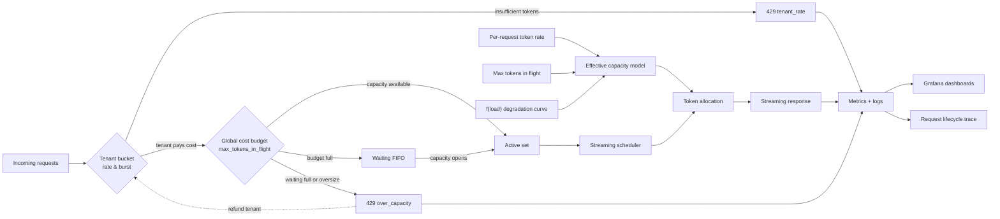

# cLLM: A Controllable LLM Inference Control Plane for Scheduling and Scaling Experiments

## 1. Abstract

Modern LLM serving systems are often evaluated through real GPU-backed deployments, which are expensive, non-deterministic, and difficult to experiment with safely. cLLM is a Kubernetes-native LLM inference control plane designed to model serving as a **token-throughput–constrained scheduling problem over shared GPU resources**.

The system provides an OpenAI-compatible API and supports both real backends (e.g., vLLM) and a synthetic execution mode that replays cached responses under a global tokens-per-second constraint. By decoupling system behavior from model execution, cLLM enables controlled, reproducible experiments on scheduling, routing, fairness, and backpressure—while still reproducing the system-level dynamics of real GPU inference.

---

## 2. Problem Statement

LLM serving systems exhibit complex behavior under load:

* Throughput saturates at GPU capacity
* Latency increases non-linearly beyond saturation
* Long requests can dominate compute
* Multi-tenant workloads introduce fairness challenges

Traditional approaches to evaluating these systems suffer from:

* **High cost** (GPU usage)
* **Low reproducibility** (hardware and runtime variability)
* **Limited control** over workload characteristics

The goal of cLLM is to provide a **deterministic, controllable environment** that reproduces the key dynamics of LLM serving systems, enabling safe and repeatable experimentation on control plane decisions.

---

## 3. System Goals

### Functional Goals

* OpenAI-compatible API for seamless integration
* Support both real inference backends and synthetic execution
* Model token-based throughput constraints

### Non-Functional Goals

* Deterministic, reproducible workloads
* Realistic latency and streaming behavior
* Fine-grained observability (per-request + system-level)
* Safe experimentation via live configuration

---

## 4. Architecture Overview

cLLM consists of three primary components:

### 4.1 Control Plane

* Request admission and scheduling
* Token-based throughput allocation
* Multi-tenant fairness enforcement

### 4.2 Execution Layer

* Real mode: routes to vLLM / OpenAI
* Synthetic mode: replays cached responses with controlled timing

### 4.3 Observability Layer

* Prometheus metrics (tokens/sec, TTFT, queue depth, latency)
* Grafana dashboards
* Structured logging with correlation IDs

The system is deployed alongside a real vLLM instance in Kubernetes, allowing **side-by-side comparison of simulated and real behavior on the same hardware**.

---

## 5. Scheduling and Admission Control

### 5.1 Core Capacity Model

cLLM models inference capacity along **two independent axes**: a *stock* of token-cost that may be in flight at any instant, and a *flow* of tokens generated per second. Each axis has its own knob and binds in different regimes; together with a load-dependent degradation function they reproduce the soft-saturation behavior of real GPU-backed inference.

* **`max_tokens_in_flight`** — the admission stock. The total estimated token cost (prompt + projected completion) the system will admit concurrently. Bound by the cost-based admission gate; binds first when many requests overlap.
* **`max_tokens_per_second`** — the replay flow. The ideal token *generation* rate of an isolated request on the synthetic execution path; binds during streaming.
* **`f(load)`** — a configurable degradation function that scales the *effective* per-request flow downward as the in-flight stock approaches saturation.

The effective per-request streaming rate is therefore:

```text
effective_tokens_per_second = max_tokens_per_second × f(load)
```

while the admission ceiling is independently bounded by `max_tokens_in_flight`. The two compose: a workload can be either admission-bound (lots of small requests filling the stock) or rate-bound (a few large requests serialized through the per-request flow), and `f(load)` couples them by slowing the flow as the stock fills.

This formulation captures three key properties of real GPU-backed inference systems:

1. **Parallel efficiency at low to moderate load**, where additional requests increase total throughput
2. **Workload-aware admission**, where one large request can consume what would otherwise be many small ones — matching how KV-cache and prefill compute actually scale
3. **Gradual performance degradation under contention**, where increased concurrency reduces per-request streaming throughput and increases latency

Unlike a fixed concurrent-requests or fixed global tokens-per-second model, this approach produces **soft saturation behavior** that is sensitive to request size, where throughput plateaus and latency increases non-linearly as the token-cost budget becomes the binding constraint.

---

### 5.2 Capacity Regimes and System Behavior

This model allows the system to simulate distinct operating regimes:

* **Throughput-bound regime**
  At low to moderate concurrency, total tokens/sec increases with additional requests as parallelism is utilized efficiently.

* **Contention regime**
  As concurrency approaches system limits, per-request throughput decreases due to shared resource pressure, while total throughput begins to plateau.

* **Queue-bound regime**
  Beyond saturation, additional requests primarily increase queueing delay (TTFT) rather than total throughput, resulting in non-linear latency growth.

These regimes mirror real inference systems, where GPU utilization, memory pressure, and scheduling overhead interact to produce complex, non-linear performance characteristics.



#### Short verbal explanation

cLLM treats inference capacity as a function of **parallelism plus contention**, not as a fixed global tokens/sec limit. Incoming requests pass through a **two-stage admission gate**:

1. **Per-tenant token bucket.** Each request must first pay its estimated `cost` against its tenant's bucket. If the tenant is over its rate/burst, the request is rejected immediately with `429 tenant_rate`.
2. **Global cost budget.** Surviving requests then compete for `max_tokens_in_flight`. If the budget has room, the request enters the active set; otherwise it joins a bounded FIFO waiting queue. If the waiting queue is full — or the request alone would exceed the entire budget — it is rejected with `429 over_capacity`, and its tenant tokens are refunded.

Admitted requests are then handled along the two capacity axes from \u00a75.1: the admission stock (`max_tokens_in_flight`) bounds how much work runs concurrently, while the per-request flow

```text
effective_tokens_per_second = max_tokens_per_second \u00d7 f(load)
```

bounds how fast each one streams. As load increases, `f(load)` reduces the per-request flow to simulate GPU contention. This creates realistic behavior: throughput rises at first, then plateaus, while TTFT and latency increase as the system becomes queue-bound \u2014 with noisy tenants absorbed by their own buckets rather than degrading neighbors.

---

### 5.3 Queue Structure and Admission Control

The scheduler maintains three request states:

* **Active set**: requests currently consuming token-cost capacity
* **Waiting queue**: buffered requests awaiting admission, served strictly FIFO
* **Rejected requests**: requests refused at the gate and returned as HTTP 429

Admission is **cost-based** rather than count-based. Each incoming request is assigned an estimated token cost:

```text
cost = prompt_tokens + min(max_tokens, p95_completion_tokens)
```

The `p95_completion_tokens` term is a rolling p95 maintained over recent successful downstream completions, with a warm-up minimum-sample threshold; until enough samples are observed the estimator falls back to the request's `max_tokens`. This makes the cost a realistic upper bound that adapts to the actual workload mix without requiring operator tuning.

A two-stage gate decides admission:

1. **Per-tenant rate limit (Stage 1).** A token-bucket per tenant, sized by `rate` (tokens/sec refill) and `burst` (max instantaneous balance). If the tenant cannot pay `cost`, the request is rejected immediately with `429 tenant rate exceeded`. This stage is non-blocking — tenants do not consume the global FIFO slot until they have paid their own bucket.
2. **Global token-cost budget (Stage 2).** A single FIFO-ordered semaphore over `max_tokens_in_flight`. If `cost` does not currently fit, the request waits until enough capacity is released or until the bounded `max_waiting_requests` queue is full, in which case it is rejected with `429 over capacity`. Requests whose `cost` exceeds the entire budget are rejected immediately rather than blocking forever.

If Stage 2 rejects a request, the tenant's Stage 1 tokens are **refunded** so a globally-rejected request does not permanently drain a tenant's quota.

Releasing capacity is cancel-aware: a client that disconnects mid-flight returns its `cost` to the global budget so the next waiting request can proceed without delay. Successful downstream completions feed both the global p95 estimator and the per-tenant p95 estimator, so cost estimates self-correct over time. Cached replays and rejections do not pollute the estimators.

Backpressure is therefore enforced on three independent dimensions — per-tenant rate, global token-cost-in-flight, and bounded waiting-queue depth — preventing unbounded latency growth under overload while keeping noisy tenants from starving the rest of the system.

---

### 5.4 Throughput Degradation

As concurrency increases beyond optimal levels:

```text
tokens/sec per request ↓
latency ↑
```

The degradation behavior is controlled by a configurable function `f(load)`, which allows the system to simulate:

* gradual contention
* soft saturation
* non-linear latency growth

This avoids unrealistic “hard cliff” capacity limits and better reflects real GPU scheduling dynamics.

---

### 5.5 Multi-Tenant Fairness

To support multi-tenant workloads and heterogeneous request sizes, cLLM enforces fairness at admission via a per-tenant token bucket. Each request is tagged with an `X-Tenant-Id` header (case-insensitive, validated against `[a-z0-9_-]{1,64}`); unknown, missing, or malformed values route to a built-in `default` tenant, which prevents Prometheus label cardinality attacks and keeps unauthenticated traffic on a single shared lane.

Each tenant has independent `rate` and `burst` parameters, configured via `configs/tenants.yaml` (overridable with `CLLM_TENANTS_FILE`) and applied at process start:

```yaml
tenants:
  default: { rate: 0,     burst: 0      }   # 0 disables the tenant gate
  interactive: { rate: 2000,  burst: 100000 }
  batch:       { rate: 50000, burst: 100000 }
```

Cost estimates are tenant-aware and use a fallback chain — **per-tenant p95 → global p95 → request `max_tokens`** — so a warm tenant gets workload-shape-specific admission decisions while cold tenants safely fall back to global behavior.

This approach:

* **Isolates noisy tenants.** A tenant that exceeds its `rate` is rejected at Stage 1 without consuming the global FIFO slot, so well-behaved tenants are not pushed deeper into the queue by another tenant's burst.
* **Preserves work conservation.** A globally-rejected request refunds the tenant bucket, so legitimate traffic is not punished for transient global contention.
* **Composes with the global gate.** Tenant limits are an *additional* constraint, not a replacement; the global cost budget still bounds total in-flight work and protects the simulated GPU.
* **Supports interactive vs batch separation.** Interactive tenants are typically configured with low `rate` and high `burst` (snappy under intermittent load); batch tenants get high sustained `rate` with moderate `burst`. Both share the same global capacity ceiling.

The result is a realistic simulation of fairness in shared inference systems without needing a stateful weighted scheduler in the active set: ordering inside the global FIFO is preserved, but each tenant's *eligibility* to enter the FIFO is gated by its own bucket.

---

## 6. Realistic Generation and Execution Model

cLLM models inference as a two-phase process—**prefill** and **decode (streaming)**—with both phases driven by the same underlying capacity and load dynamics. Rather than treating latency as a fixed delay, the system applies **load-aware degradation and controlled variability** to reproduce the non-ideal behavior of real inference systems.

---

### 6.1 Prefill Latency

Prefill latency is modeled as a **load-dependent startup cost** proportional to prompt size:

```text
prefill_time ∝ prompt_tokens / effective_prefill_rate
```

Where:

* **effective_prefill_rate** is derived from the system’s capacity model and degrades as concurrency increases
* prefill latency increases under load, reflecting contention for CPU resources, memory bandwidth, and attention setup

To capture real-world variability, prefill includes:

* **Load-dependent degradation** — latency increases as system pressure rises
* **Jitter** — stochastic variation to simulate CPU scheduling, caching effects, and runtime overhead

Prefill is **coupled to the global capacity model**, ensuring that changes in throughput, concurrency limits, or degradation curves consistently affect both startup and generation behavior.

---

### 6.2 Decode and Streaming Behavior

After prefill, requests enter the decode phase, where tokens are emitted over time based on allocated throughput.

Token emission is governed by:

* **Allocated tokens/sec** from the scheduler
* **Weighted fairness**, based on tenant priority, request size, and queue age
* **System load**, via the degradation function

Streaming behavior includes:

* **Jitter and burstiness** — tokens are emitted in uneven intervals rather than a fixed cadence
* **Partial stalls** — probabilistic pauses that simulate:

  * attention bottlenecks
  * memory pressure
  * scheduling delays

These effects ensure that token generation reflects the variability of real GPU-backed inference rather than idealized constant-rate output.

---

### 6.3 Unified Load-Driven Behavior

Both prefill and decode phases are driven by the same underlying capacity model:

* At low load:

  * prefill is fast
  * tokens stream at near-ideal rates

* Under contention:

  * prefill latency increases
  * per-request throughput decreases
  * jitter and stalls become more pronounced

* Under saturation:

  * queueing dominates latency (TTFT)
  * streaming slows due to reduced token allocation

This unified model ensures that all phases of request execution respond consistently to system pressure, avoiding unrealistic scenarios where one phase degrades while others remain constant.

---

### 6.4 Latency Decomposition

Total request latency is decomposed into:

```text
Total Latency = TTFT + Streaming Duration
```

Where:

* **TTFT (Time To First Token)** includes:

  * queueing delay
  * scheduling delay
  * prefill latency

* **Streaming Duration** reflects:

  * token generation under throughput constraints
  * variability due to jitter and stalls

This decomposition allows precise attribution of latency to specific system behaviors, enabling targeted optimization of scheduling, admission control, and resource allocation.

---

### 6.5 Realism Is Opt-In by Default

The realism mechanisms described above (prefill simulation, jitter, rate variability, partial stalls) are **disabled by default**. Out of the box the system replays cached responses at a strict per-request TPS cadence with global degradation `f(load)` still applied; nothing else perturbs the schedule. This is intentional:

* **Predictable baseline.** A fresh deployment behaves like a clean rate-limited replay, which makes throughput sweeps and scheduling experiments trivially reproducible.
* **Additive composition.** Realism is then layered on by enabling individual classes (prefill rate multiplier, jitter percent, stall probability, etc.) via flags, environment variables, or `/config` updates, or by selecting a DSL profile that bundles them.
* **Per-experiment scoping.** Because realism is opt-in, an experiment that needs (for example) prefill-heavy behavior on one tenant and a clean baseline on another can express that with a default profile plus per-request DSL directives, without dual deployments.

In short: TPS pacing and load-driven degradation are always on; everything else is opt-in.

---

## 7. Observability and Traceability

### 7.1 Request-Level Tracing

Each request is assigned a **correlation ID** and tracked through:

```text
received → [queued] → admitted → started → [dsl_applied] → [prefill] → first_token → completed | rejected
```

Bracketed events are conditional: `queued` fires only when the global gate forces a wait (so an immediately-admitted request emits only `admitted`); `dsl_applied` fires when one or more DSL directives are parsed; `prefill` fires only on cache hits with prefill simulation enabled. `rejected` is a terminal event that may replace any later event when admission, validation, or downstream processing fails.

This enables root-cause analysis of latency:

* queueing delay
* scheduling delay
* prefill cost
* streaming behavior
* stall events

---

### 7.2 System-Level Metrics

Key metrics include:

* tokens/sec (global + per request)
* TTFT (proxy for queueing delay)
* queue depth and wait time
* latency percentiles (P50/P95/P99)
* stall and prefill histograms
* **token-cost in flight** vs `max_tokens_in_flight` (admission saturation)
* **per-tenant admissions and rejections** via `cllm_tenant_admissions_total{tenant}` and `cllm_tenant_rejections_total{tenant, reason}` where `reason ∈ {tenant_rate, over_capacity}`

Lifecycle log events include `tenant` and `cost` fields for every request, so per-tenant attribution is available in both metrics and logs.

---

### 7.3 Latency Decomposition

```text
Total Latency = TTFT + Streaming Duration
```

Where:

* TTFT = queueing + scheduling + prefill
* Streaming duration = token throughput under contention

This decomposition enables precise reasoning about system bottlenecks.

---

## 8. Live Reconfiguration and Experimentation

The system exposes a `/config` API allowing runtime changes to:

* token capacity (`max_tokens_in_flight`, `max_tokens_per_second`, `max_waiting_requests`)
* degradation curves
* DSL default profile
* realism parameters (prefill, jitter, stalls)

Tenant rate/burst are loaded from `configs/tenants.yaml` at startup and are not currently editable through `/config`; updates require a restart or a programmatic call to `Handler.SetTenants`.

This enables:

* A/B testing of scheduling policies
* rapid iteration without restarts
* real-time observation of system behavior changes

---

## 9. Reproducible Workloads

cLLM treats cached prompts as **versioned workload artifacts**:

* prompt sets can be recorded and replayed
* token pacing derived from real BPE token counts
* identical workloads can be replayed across configurations

This ensures:

* deterministic benchmarking
* reproducible experiments

---

## 10. Validation Against Real Systems

cLLM is validated by running alongside vLLM in the same Kubernetes cluster:

* GPU telemetry via DCGM
* shared dashboards
* identical workloads

Observed alignment:

* throughput saturation behavior
* TTFT growth under load
* queue dynamics
* fairness effects

While hardware-level details are abstracted, the simulator accurately reproduces the **system-level behaviors that drive control plane decisions**.

---

## 11. Replay DSL (Per-Request Execution Directives)

cLLM includes a **Replay DSL** that allows individual requests to carry execution directives which modify replay behavior without changing workload identity or global configuration. This turns the control plane into a **per-request experiment surface**, enabling mixed workloads, targeted fault injection, and reproducible scenario design.

---

### 11.1 Design Goals

* **Per-request control** without service restarts or global config changes
* **Reproducibility**: identical prompts map to the same cache entry regardless of directives
* **Safety and predictability**: deterministic parsing with clear precedence rules
* **Observability**: directives are visible in logs and metrics
* **Composability**: a small grammar of orthogonal directives plus named profile bundles

---

### 11.2 Syntax and Parsing

Directives are embedded in prompts using a `:dsl` marker (case-insensitive). The parser:

* **Strips the marker and every trailing whitespace-separated token** from the message before forwarding to downstream models and before cache key generation
* Applies **first-occurrence-of-each-class-wins** semantics across all messages (e.g., the first `tps=` directive in any message wins; later same-class directives are silently dropped)
* Resolves ranges and randomness against a shared jitter source so a fixed seed produces a fixed schedule
* Treats `no-cache` as having the highest precedence — it is honored regardless of position in the token stream
* Treats `no-delay` as a **macro** that expands to `no-prefill no-jitter no-variability no-stall`; it does **not** halt parsing and does **not** disable TPS pacing

Numeric directives use a uniform `key=value` shape. The `=` is optional, so `segment 50` and `segment=50` are equivalent. Values are signed integers (`50`, `-30`) or signed ranges `lo:hi` (`30:50`, `-50:-30`, `-20:20`); inverted bounds are normalized by swapping. For ranges, the value is drawn uniformly from `[lo, hi]` once per request, except `segment=…` which redraws per stream segment.

Example:

```text
:dsl tps=80 jitter=20 stall=5
Explain how transformers work.
```

After parsing:

* Clean prompt: `Explain how transformers work.`
* Cache key derived from the cleaned prompt only
* Applied overrides: `tps=80`, `jitter+=20pp`, `stall+=5pp`

---

### 11.3 Supported Directive Classes

The DSL groups directives into orthogonal classes; each class can be claimed at most once per request (first-wins).

* **Cache control**

  * `no-cache` — bypass cache lookup; refresh-write the response (highest precedence)
* **Throughput**

  * `tps=N` / `tps=A:B` — pin per-request decode rate (1–2048)
  * `no-tps` — disable TPS pacing entirely (claims the `tps` class, so a later `tps=N` is ignored)
* **Latency / Timing**

  * `no-delay` — macro for `no-prefill no-jitter no-variability no-stall` (TPS pacing still applies)
  * `no-prefill` — skip prefill simulation only
  * `prefill=N` / `prefill=A:B` — scale prefill duration by `(1 + N/100)`; negatives shrink
  * `segment=N` / `segment=A:B` — per-segment delay scale, redrawn each segment; negatives shrink
* **Variability and Faults**

  * `jitter=N` / `jitter=A:B` — add signed percentage points to jitter, clamped 0–100
  * `variability=N` / `variability=A:B` — same shape, on rate variability
  * `stall=N` / `stall=A:B` — same shape, on stall probability
  * `no-jitter` / `no-variability` / `no-stall` — zero out the corresponding class
* **Response shaping**

  * `max-tokens=N` / `max-tokens=A:B` — override `max_tokens` for this request (does not affect cache key)
* **Composition**

  * `profile=NAME` — expand a named directive bundle (see 11.5)

A bare keyword followed by a non-numeric next token is treated as a no-op; the next token is then parsed independently. Unknown or malformed tokens are silently ignored for forward compatibility.

---

### 11.4 Execution Model Integration

Parsed directives are carried as **replay overrides** through the execution pipeline:

* `cachedReplayDelay(tokens, overrides)` — honors `noTPS` and `tpsOverride`
* `computePrefillDelay(tokens, overrides)` — honors `noPrefill` and `prefillDurationScale`
* `computeStreamSegmentDelay(tokens, overrides)` — applies `delayScaleFn` per segment, plus jitter/variability/stall via the override functions

Overrides affect:

* Prefill latency (skip or scaled multiplicatively)
* Streaming token pacing (per-request TPS, plus per-segment scale)
* Jitter, variability, and stall behavior (per-class deltas on top of handler defaults, clamped 0–100)
* Per-request `max_tokens` shaping for both cached and live paths

Global degradation (`f(load)`) is still applied on top of per-request overrides, so per-request adjustments compose with system-wide contention modeling rather than replacing it.

---

### 11.5 Profiles

Profiles are **named directive bundles** loaded from `configs/profiles.yaml` at startup. They keep prompts terse for benchmark scenarios — the prompt names a profile and the server expands it.

Resolution order:

1. `CLLM_DSL_PROFILES_FILE` (explicit override; YAML or JSON; missing file is an error)
2. `./configs/profiles.yaml` relative to the working directory
3. `configs/profiles.yaml` next to the running binary

Each entry's value is either a space-separated string of directive tokens or a YAML list of token strings. Profile bundles are expanded **after** explicit prompt directives, so an explicit token in the prompt always wins on conflicts (e.g. `:dsl tps=50 profile=interactive` keeps `tps=50` and inherits `no-stall`/`no-jitter` from the profile). Only the first `profile=` token is honored; unknown profile names are silently ignored.

The shipped catalog includes:

| Group | Names | Effect |
|---|---|---|
| Style | `interactive`, `batch`, `stall-heavy`, `prefill-heavy` | Snappy / throughput / pathological / slow-TTFB |
| Speed (faster) | `fast`, `faster`, `fastest` | Per-segment delay **and** prefill duration shrunk by 0–10%, 10–25%, 25–50% |
| Speed (slower) | `slow`, `slower`, `slowest` | Per-segment delay **and** prefill duration grown by 0–10%, 10–25%, 25–50% |
| TPS sweep | `tps-16`, `tps-32`, `tps-64`, `tps-128`, `tps-256`, `tps-512`, `tps-1024`, `tps-1536`, `tps-2048` | Pin tokens-per-second; `no-delay` macro disables prefill/jitter/variability/stall |

---

### 11.5.1 Server-Wide Default Profile

A single profile may be designated as the **server-wide default**, applied to every request that omits the `:dsl` marker entirely. This lets operators shift the baseline replay behavior of an entire deployment without modifying client prompts.

**Scope.** The default profile applies only when **no message in the request carries `:dsl`**. Any presence of `:dsl` — even an empty marker, or one that only carries `no-cache` — fully suppresses the default. This keeps the rule simple: prompts that opt into the DSL get exactly what they asked for; prompts that don't get the server default.

**Precedence.**

1. The default profile is the lowest-priority source of directives.
2. Any `:dsl` marker in the prompt suppresses the default profile entirely.
3. An explicit `profile=NAME` token in the prompt replaces (does not stack with) the default.
4. First-wins-per-class still applies, so individual prompt directives (e.g. `tps=50`) override the same class supplied by the default profile bundle.

**Configuration surfaces.**

* Flag: `--dsl-profile NAME`
* Environment: `CACHE_DSL_PROFILE=NAME`
* Runtime: `GET /config?dsl-profile=NAME` (or `dsl_profile=NAME`); send the parameter with an empty value to clear it.

**Validation.** The named profile must exist in the loaded profile map at the moment it is set; unknown names are rejected at startup and on `/config` updates. The current default (or empty) is reported by `GET /config` as `dsl_default_profile`.

**Observability.** When the default fires, the resulting request still emits `profile=NAME` in its directive list and in the `dsl_applied` lifecycle event, so dashboards cannot distinguish "prompt asked for `profile=fast`" from "server default expanded `profile=fast`" — by design. The two paths have identical execution semantics.

---

### 11.6 Cache and Workload Identity

A key design principle is that **DSL directives do not affect cache identity**:

* Cache keys are generated **after directive stripping**
* Multiple DSL variants of the same prompt map to the **same cached response**
* `no-cache` bypasses the lookup but still writes the downstream response back into the cache (refresh semantics)

This ensures:

* reproducible workloads across runs
* consistent benchmarking across different execution scenarios
* separation of *what is said* (prompt) from *how it is executed* (DSL)

---

### 11.7 Observability

DSL usage is fully instrumented:

* **Lifecycle event**: `dsl_applied` includes the parsed directive list
* **Metrics**:

  ```text
  cllm_dsl_directives_total{endpoint, directive}
  cllm_dsl_requests_total{endpoint, family, result}
  ```

  `directive` carries the literal token (`tps=128`, `segment=-20:20`, `profile=fastest`); `family` collapses numeric values to the keyword (`tps`, `segment`, `profile=fastest`) for low-cardinality dashboards.

This enables:

* tracking directive usage across workloads
* correlating directives with latency, TTFT, and throughput
* debugging unexpected behavior introduced by prompt-level overrides

---

### 11.8 Use Cases

The Replay DSL enables several high-value scenarios:

* **Mixed workload simulation**
  Different prompts in the same test can simulate interactive, batch, or degraded requests by selecting different profiles
* **Fault injection**
  Introduce stalls, jitter, or degraded throughput on a subset of requests
* **A/B testing**
  Compare scheduling policies or replay characteristics without changing global config
* **Reproducible experiments**
  Combined with cached workloads and a fixed jitter seed, DSL directives allow deterministic replay of complex scenarios
* **Throughput sweeps**
  The `tps-*` profile family lets a single benchmark script walk decode rates from 16 to 2048 tps with no configuration churn

---

### 11.9 Example Scenarios

#### Interactive vs Batch

```text
:dsl profile=interactive
Summarize this article.
```

```text
:dsl tps=20 prefill=100
Generate a long-form report on climate change.
```

---

#### Fault Injection

```text
:dsl stall=10 jitter=30
Explain distributed systems.
```

---

#### Zero-Latency Replay

```text
:dsl no-delay no-tps
Return cached result immediately.
```

---

#### TPS Sweep with Reply Cap

```text
:dsl profile=tps-512 max-tokens=128
Explain Azure.
```

---

#### Symmetric Stream Jitter

```text
:dsl segment=-20:20
Show me a streaming response that wobbles around real-time.
```

---

### 11.10 Key Insight

The Replay DSL extends cLLM from a configurable system into a **programmable execution environment**:

* Global configuration controls system-wide behavior
* DSL directives control per-request behavior
* Profiles compose directives into reusable benchmark scenarios
* Cache artifacts control workload identity

Together, these allow **precise, reproducible, and composable experiments** on LLM inference systems—something that is difficult to achieve with real GPU-backed deployments alone.

---

## 12. Key Insights

1. **LLM serving is dominated by scheduling and queueing, not raw compute**
2. **Tokens are the correct unit of resource modeling**
3. **Latency is primarily driven by queueing under contention**
4. **Small scheduling changes can significantly impact fairness and tail latency**
5. **Deterministic simulation enables safer and faster iteration than GPU-only testing**

---

## 13. Future Work

* Multi-node routing across heterogeneous GPU clusters
* KV cache and memory pressure modeling
* adaptive scheduling based on real-time metrics
* failure injection (node degradation, network issues)

---

## 14. Conclusion

cLLM is not just a simulator—it is a **controllable, instrumented, and validated LLM inference system** that enables the design, testing, and validation of scheduling and scaling decisions before deploying to real GPU infrastructure.
