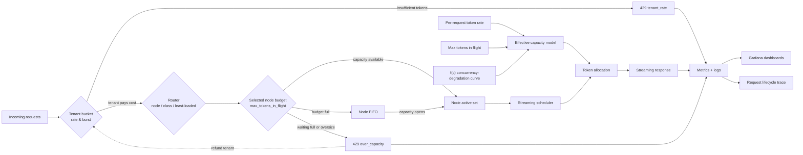

# cLLM: A GPU-Calibrated Experimentation Platform for LLM Inference

## TL;DR

cLLM is a Kubernetes-native GPU experimentation platform for LLM serving that speaks the **Chat Completions API** — the de-facto industry wire format originally defined by OpenAI and now also implemented by vLLM, Azure OpenAI, OpenRouter, Together, Groq, and most other production inference stacks. A single physical GPU calibrates a synthetic execution path; one cLLM process can then model a heterogeneous fleet of vLLM-like nodes — each with its own capacity envelope, FIFO queue, and optional upstream metadata — on the same machine, at no additional GPU cost.

What it buys an engineering team:

* **Tokens are the resource, not requests.** The shift from CPU serving to GPU-backed LLM serving is a shift in the unit of accounting: one 4k-token request can displace dozens of small ones from KV cache and prefill, so RPS-based limits silently mis-allocate the fleet. cLLM treats `prompt + min(max_tokens, p95)` as the admission cost everywhere — admission, fairness, capacity scaling, and the DSL all speak the same currency.
* **Calibrate once, experiment forever.** One real-GPU benchmark anchors a class envelope; every subsequent scheduling, fairness, admission, routing, or capacity-scaling experiment runs against that envelope without renting more hardware.
* **Multi-node experiments without multi-node hardware.** A cLLM node models a vLLM instance, not a GPU. A single process can host real and synthetic nodes across GPU classes, with per-node admission stock, per-node FIFO queues, and load-aware routing.
* **Multi-target benchmarks without multi-target hardware.** Real vLLM, pass-through, and synthetic streams run side-by-side in one time window, on one GPU host, against one three-layer dashboard stack (cLLM, vLLM, GPU).
* **A per-request experiment surface.** A small in-prompt DSL (`:dsl tps=…`, `no-cache`, `re-cache`, profiles) composes with live `/config` knobs, so mixed workloads, A/B comparisons, and targeted fault injection run inside a single deployment with no restarts.
* **Validation is a primitive, not a milestone.** The same `:dsl no-cache` mechanism that calibrates the system also validates and reproduces it — any operator can re-validate at the cost of a single benchmark run.
* **Reproducible workloads survive cluster rebuilds.** Cached prompts are versioned artifacts; a snapshot loaded on different hardware reproduces the same synthetic envelope.
* **Runs almost anywhere.** Because the synthetic path needs no GPU at runtime, a calibrated cache library replays on engineering laptops (macOS, Windows, Linux), CPU-only CI runners, and air-gapped hosts — the calibration host is the only paid GPU hour, and one calibration host serves the whole organization (§13).

What it is not: a kernel-level GPU simulator. Micro-architectural effects (KV-cache pressure spikes, batch-scheduler interleaving) are intentionally abstracted; *system* dynamics — admission, queueing, fairness, routing, backpressure, capacity scaling — are faithfully modeled and continuously validated against a real vLLM running on the same GPU.

---

## 1. Abstract

Modern LLM serving systems are often evaluated through real GPU-backed deployments, which are expensive, non-deterministic, and difficult to experiment with safely. cLLM is a Kubernetes-native LLM inference control plane designed to model serving as a **token-throughput–constrained scheduling problem over shared GPU resources**.

The system speaks the Chat Completions API (the OpenAI-defined `/v1/chat/completions` wire format, also implemented by vLLM, Azure OpenAI, OpenRouter, and similar stacks) and supports both real backends (e.g., vLLM) and synthetic execution nodes that replay cached responses under per-request rate pacing, cost-based admission, per-tenant fairness, per-node routing, controlled prefill, jitter, and stall injection. By decoupling system behavior from model execution, cLLM enables controlled, reproducible experiments on scheduling, routing, fairness, and backpressure — including heterogeneous fleet and capacity-scaling experiments calibrated against a real GPU baseline on the same hardware — while still reproducing the system-level dynamics of real GPU inference. Because the synthetic path requires no GPU at runtime, the calibration host is the only paid GPU hour: experiments replay on laptops, CI runners, and air-gapped hosts at no additional GPU cost (§13).

---

## 2. Key Insights

1. **LLM serving is dominated by scheduling and queueing, not raw compute.** Throughput plateaus and tail-latency growth come from admission contention, queue dynamics, and per-tenant fairness — not from how fast a single token is generated. This is why cLLM models *system* behavior with high fidelity while abstracting micro-architectural GPU effects.
2. **Tokens are the correct unit of resource modeling.** Cost-based admission (`prompt + min(max_tokens, p95)`) reflects how KV-cache and prefill compute actually scale, so one large request can correctly displace many small ones — a property that count-based limits cannot express (§6.1, §6.3).
3. **Latency is primarily driven by queueing under contention.** The per-request rate curve under `f(c)` is linear past the activation threshold; it is the queue/admission interaction on top of that curve that produces the soft-saturation, non-linear TTFT growth observed on real systems (§6.2, §6.4).
4. **Small scheduling changes can significantly impact fairness and tail latency.** Per-tenant token buckets gate eligibility before routing, isolating noisy tenants without a stateful weighted scheduler in the active set. Tenant refunds on capacity rejection preserve work conservation (§6.5).
5. **A single physical GPU is enough to model an N-node deployment.** Calibrating the synthetic envelope against a real backend lets cLLM instantiate many in-process nodes with per-node capacity, queues, and routing policy. A node models a vLLM instance, not a GPU, so sticky routing and per-node saturation are part of the experiment rather than hidden behind one global queue (§6.6, §6.7).
6. **Per-request reconfiguration is more powerful than global reconfiguration.** The Replay DSL composes with `/config` so a single deployment runs mixed workloads, A/B comparisons, and targeted fault injection in the same time window — turning the control plane into a per-request experiment surface (§9.1, §12).
7. **Reproducibility is a property of cached workloads, not just stored prompts.** A pass-through real-backend run captures ground truth into the cache, after which the same prompts replay synthetically at the calibrated envelope at zero GPU cost. Cache snapshots (`action=save`/`load`) make the workload library portable across machines and CI runs (§10.1).
8. **Concurrent multi-target benchmarking is what makes the platform a platform.** Real, pass-through, and synthetic streams run side-by-side on the same GPU host, sharing one time axis and one dashboard stack — direct cross-validation, no time-stitched runs, no extra hardware (§10.2, §11.3).
9. **Three-layer observability closes the loop.** `cllm-overview`, `vllm-overview`, and `gpu-overview` answer "what did the system do?", "what did the serving stack do?", and "what did the GPU do?" on a shared time axis with shared request-correlation IDs, DSL-family partitioning, and per-node fleet panels, so every experiment is interpretable end-to-end (§8.4).
10. **Deterministic simulation enables safer and faster iteration than GPU-only testing.** Combined with side-by-side validation against vLLM, the synthetic path matches real-system dynamics at the shape level while staying honest about what it does not model (KV-cache pressure spikes, batch-scheduler interleaving, content-dependent decode variance — §6.6, §11.4).
11. **The cost of experimentation is decoupled from the cost of the system being experimented on.** Calibration is the only paid GPU hour; subsequent scheduling, fairness, and capacity-scaling experiments run on the cached library at no additional GPU cost. Because the synthetic path needs no GPU at runtime, experiments replay on laptops, CPU-only CI runners, and air-gapped hosts — removing GPU provisioning, quota, and tear-down churn from the experiment loop (§13).

---

## 3. Problem Statement

LLM serving systems exhibit complex behavior under load:

* Throughput saturates at GPU capacity
* Latency increases non-linearly beyond saturation
* Long requests can dominate compute under count-based admission
* Multi-tenant workloads introduce noisy-neighbor effects that count-based limits cannot isolate
* Workload identity (the prompt) and execution behavior (pacing, faults) are usually entangled, hurting reproducibility
* Configuration changes typically require redeployment, lengthening experiment cycles

Traditional approaches to evaluating these systems suffer from:

* **High cost** (GPU usage)
* **Low reproducibility** (hardware and runtime variability)
* **Limited control** over workload characteristics

The goal of cLLM is to provide a **deterministic, controllable environment** that reproduces the key dynamics of LLM serving systems, enabling safe and repeatable experimentation on control plane decisions.

---

## 4. System Goals

### Functional Goals

* Chat Completions API (`/v1/chat/completions`) for seamless integration with any client that already speaks the OpenAI / vLLM / Azure OpenAI wire format
* Per-request routing across an in-process node fleet plus Chat Completions API upstreams and synthetic cache-replay paths
* Token-based throughput constraints with cost-based admission
* Per-request behavioral overrides via an in-prompt **DSL directive system** (`:dsl …`)
* Per-tenant fairness with independent rate/burst buckets
* In-process multi-node fleet modeling via `configs/nodes.yaml`
* Live runtime configuration over HTTP without redeploy
* Realistic generation mechanics: prefill simulation, inter-token pacing, jitter, and stream stalls
* Capacity-scaling sandbox: simulate N-node / N×GPU-class deployments calibrated against measured baselines

### Non-Functional Goals

* Deterministic, reproducible workloads
* Realistic latency and streaming behavior
* Fine-grained observability (per-request + system-level)
* Safe experimentation via live configuration
* Calibration against a real GPU baseline on the same hardware

---

## 5. Architecture Overview

cLLM consists of four primary components:

### 5.1 Control Plane

* Request admission and scheduling (cost-based tenant gate plus per-node cost gates)
* Token-based throughput allocation
* Multi-tenant fairness enforcement (per-tenant token buckets)
* Fleet routing policy (`class-pinned`, `least-loaded`, or `chained`)
* DSL directive parser for per-request behavioral overrides
* Live runtime configuration endpoints (`GET /config`, `POST /config`)
* Cache inspection endpoints (`GET /cache`, `GET /cache/{key}`)

### 5.2 Node Fleet

cLLM models a fleet as a list of in-process **nodes**. A node models a
vLLM-like serving instance, not a bare GPU. Each node owns:

* A calibrated capacity envelope (`max_tokens_in_flight`, `per_request_tokens_per_second`, `max_concurrency`, `degradation_threshold`, `max_waiting_requests`)
* Its own token-cost admission stock and FIFO waiting queue
* Its own completion-token estimator
* Per-node or inherited class realism knobs (`f(c)` concurrency-degradation curve, prefill, jitter, variability, stalls)
* Optional Chat Completions API upstream metadata for pass-through / calibration nodes
* Optional `bypass_cache: true` flag that forces `:dsl no-cache` semantics for every request routed to the node — used for "real GPU baseline" passthrough lanes (e.g. the `vllm` node) so cache hits from peer lanes never contaminate upstream-only measurements

Nodes are loaded from `configs/nodes.yaml` (or `CLLM_NODES_FILE`). If no node
file is present, the handler synthesizes one `default` node from the existing
flat configuration, preserving single-node behavior.

### 5.3 Execution Layer

Routing is **per-request**, not a deployment-time mode switch. Each
`POST /v1/chat/completions` request is dispatched as follows:

* The Replay DSL may pin routing with `:dsl node=ID` or `:dsl node-class=CLASS`.
* The router honors explicit pins first, then uses least-loaded routing by default. Least-loaded routing compares each candidate node's in-flight/capacity ratio and skips nodes whose remaining budget cannot fit the request cost; ties break on lexical node ID for determinism.
* The configured `router.policy` accepts `class-pinned`, `least-loaded`, or `chained`. `chained` and the empty/default value both expand to `Chained{ClassPinned, LeastLoaded}`; `class-pinned` runs only the pin stage and returns `400 no_node_match` when neither `node=` nor `node-class=` is present. Unknown values fall back to `least-loaded`.
* **Cache hit** (and no `:dsl no-cache` / `:dsl re-cache` directive): the selected synthetic node replays the cached response under per-request TPS pacing, prefill simulation, inter-token jitter, and configurable stream stalls.
* **Cache miss, or `:dsl no-cache`, or `:dsl re-cache`**: the request is forwarded to the configured Chat Completions API upstream (vLLM, Azure OpenAI, OpenAI, or any other implementation of the same wire format). On success, the response is written back to the cache unless `no-cache` was specified (`re-cache` writes back; `no-cache` does neither lookup nor write). The selected node still owns admission, queueing, and per-node metrics for that request. A node configured with `bypass_cache: true` is treated as if `no-cache` were set on every request routed to it, regardless of incoming DSL.

Execution-layer mechanics that shape observed latency and throughput:

* TPS pacing of streamed tokens (per-request `tps`)
* Prefill duration simulation (TTFT shaping)
* Inter-token jitter
* Configurable stream stalls (frequency × duration)

### 5.4 Observability Layer

* Prometheus metrics across multiple families:
  * **HTTP / lifecycle:** `cllm_http_requests_total`, `cllm_http_inflight_requests`, `cllm_http_request_duration_seconds`, `cllm_request_lifecycle_events_total`
  * **Throughput / latency:** `cllm_completion_tokens_total`, `cllm_time_to_first_byte_seconds`, `cllm_job_duration_seconds`, `cllm_queue_wait_duration_seconds`
  * **Generation simulation:** `cllm_prefill_duration_seconds`, `cllm_stream_stalls_total`, `cllm_stream_stall_duration_seconds`
  * **Cache:** `cllm_cache_lookups_total`
  * **DSL:** `cllm_dsl_directives_total`, `cllm_dsl_requests_total`, `cllm_dsl_time_to_first_byte_seconds`, `cllm_dsl_job_duration_seconds`
  * **Tenants:** `cllm_tenant_admissions_total`, `cllm_tenant_rejections_total`
  * **Nodes (multi-node mode only):** `cllm_node_tokens_in_flight`, `cllm_node_max_tokens_in_flight`, `cllm_node_waiting_requests`, `cllm_node_admissions_total`, `cllm_node_queue_wait_seconds`. The handler suppresses every `cllm_node_*` series when only one node is loaded (the single-node default fleet) — the global `cllm_tokens_in_flight` and friends already cover that case, so single-node deployments emit zero per-node cardinality.
  * **KV pressure (KV-enabled nodes only):** `cllm_node_kv_tokens_in_flight`, `cllm_node_max_kv_tokens`, `cllm_node_combined_load`. Emitted only for nodes with `max_kv_tokens > 0`; mixed fleets (some KV-modeled, some not) emit KV series only for the modeled nodes. The `cllm_tenant_rejections_total` counter gains two reasons — `kv_pressure` and `kv_oversize` — distinguishing memory-axis admission failures from compute-axis `over_capacity` (§6.8).
  * **Upstream:** `cllm_downstream_request_duration_seconds`
* Grafana dashboards: `cllm-overview`, `vllm-overview`, `gpu-overview`, plus DSL-specific panels for per-directive request rate, rejection rate, TTFT P95, latency P95, and fleet panels for per-node saturation, fill ratio, admission rate, and queue wait.
* Structured logging with correlation IDs (`X-Request-ID`, propagated via context and slog)

The system is deployed alongside a real vLLM instance in Kubernetes, allowing **side-by-side comparison of synthetic and real behavior on the same hardware**.

---

## 6. Scheduling and Admission Control

### 6.1 Core Capacity Model

cLLM models inference capacity along **two independent axes per node**: a *stock* of token-cost that may be in flight on that node at any instant, and a *flow* of tokens generated per second by that node. Each axis has its own knob and binds in different regimes; together with a load-dependent degradation function they reproduce the soft-saturation behavior of real GPU-backed inference.

* **`max_tokens_in_flight`** — the admission stock. The total estimated token cost (prompt + projected completion) the system will admit concurrently. Bound by the cost-based admission gate; binds first when many requests overlap.
* **`per_request_tokens_per_second`** — the per-request decode flow. The ideal token *generation* rate of an isolated request on the synthetic execution path; binds during streaming. Each node carries its own value (item 15, 0.13.0).
* **`f(c)`** — a vLLM-shaped three-regime curve over per-node concurrency `c = ConcurrentRequests()`: full rate at `c ≤ degradation_threshold`, linear ramp to `base × (1 − max_degradation/100)` between `degradation_threshold` and `max_concurrency`, and queueing past `max_concurrency` (admitted via the per-node concurrency gate). Each node has its own `max_concurrency`, `degradation_threshold`, and `max_degradation` (inherited from class template, overridable per-node in `configs/nodes.yaml`).

The effective per-request streaming rate is therefore:

```text
effective_tokens_per_second = per_request_tokens_per_second × f(c)
```

where `c` is the live count of admitted requests on the routed node. The admission ceiling is independently bounded by that node's `max_tokens_in_flight` and `max_concurrency`. The two compose: a workload can be either admission-bound (lots of small requests filling the cost budget) or rate-bound (a few large requests serialized through the per-request flow), and `f(c)` couples them by slowing the flow as the node's batch slots fill.

This formulation captures three key properties of real GPU-backed inference systems:

1. **Parallel efficiency at low to moderate load**, where additional requests increase total throughput
2. **Workload-aware admission**, where one large request can consume what would otherwise be many small ones — matching how KV-cache and prefill compute actually scale
3. **Gradual performance degradation under contention**, where increased concurrency reduces per-request streaming throughput and increases latency

Unlike a fixed concurrent-requests or fixed global tokens-per-second model, this approach produces **soft saturation behavior** that is sensitive to request size, where throughput plateaus and latency increases non-linearly as a node's token-cost budget becomes the binding constraint. In multi-node mode, fleet behavior emerges from routing requests onto independent node-local stocks and FIFOs.

---

### 6.2 Capacity Regimes and System Behavior

This model allows the system to simulate distinct operating regimes:

* **Throughput-bound regime**
  At low to moderate concurrency, total tokens/sec increases with additional requests as parallelism is utilized efficiently.

* **Contention regime**
  As concurrency approaches system limits, per-request throughput decreases due to shared resource pressure, while total throughput begins to plateau.

* **Queue-bound regime**
  Beyond saturation, additional requests primarily increase queueing delay (TTFT) rather than total throughput, resulting in non-linear latency growth.

These regimes mirror real inference systems, where GPU utilization, memory pressure, and scheduling overhead interact to produce complex, non-linear performance characteristics.



#### Short verbal explanation

cLLM treats inference capacity as a function of **parallelism plus contention**, not as a fixed global tokens/sec limit. Incoming requests pass through tenant fairness, routing, and node-local admission:

1. **Per-tenant token bucket.** Each request must first pay its estimated `cost` against its tenant's bucket. If the tenant is over its rate/burst, the request is rejected immediately with `429 tenant_rate`.
2. **Router.** Surviving requests are assigned to a node. Explicit `:dsl node=` and `:dsl node-class=` pins are honored first; otherwise the default router chooses the least-loaded node whose remaining stock can fit the request cost.
3. **Node cost budget.** The selected node owns its own `max_tokens_in_flight` stock and bounded FIFO. If the budget has room, the request enters that node's active set; otherwise it waits in that node's FIFO. If the waiting queue is full — or the request alone would exceed the node's entire budget — it is rejected with `429 over_capacity`, and its tenant tokens are refunded.

Admitted requests are then handled along the two capacity axes from §6.1: the selected node's admission stock (`max_tokens_in_flight`) bounds how much work runs concurrently on that node, while the per-request flow

```text
effective_tokens_per_second = per_request_tokens_per_second × f(c)
```

bounds how fast each one streams. As per-node concurrency rises, `f(c)` reduces the per-request flow to simulate GPU batch contention. This creates realistic behavior: throughput rises at first, then plateaus, while TTFT and latency increase as a node becomes queue-bound — with noisy tenants absorbed by their own buckets rather than degrading neighbors. Because queues are per-node, cLLM also reproduces the production failure mode where a bad routing decision can leave one node saturated while another is idle.

---

### 6.3 Queue Structure and Admission Control

The scheduler maintains four request states:

* **Active set**: requests currently consuming token-cost capacity on a node
* **Waiting queue**: buffered requests awaiting admission, served strictly FIFO per node
* **Rejected requests**: requests refused at the gate and returned as HTTP 429
* **Cancelled requests**: client-disconnect mid-flight; the request returns its `cost` to the selected node's budget so the next waiting request can proceed without delay

Admission is **cost-based** rather than count-based. Each incoming request is assigned an estimated token cost:

```text
cost = prompt_tokens + min(max_tokens, p95_completion_tokens)
```

The `p95_completion_tokens` term is a rolling p95 maintained over recent successful downstream completions, with a warm-up minimum-sample threshold; until enough samples are observed the estimator falls back to the request's `max_tokens`. This makes the cost a realistic upper bound that adapts to the actual workload mix without requiring operator tuning.

A three-step path decides routing and admission:

1. **Per-tenant rate limit (Stage 1).** A token-bucket per tenant, sized by `rate` (tokens/sec refill) and `burst` (max instantaneous balance). If the tenant cannot pay `cost`, the request is rejected immediately with `429 tenant rate exceeded`. This stage is non-blocking — tenants do not consume routing or node FIFO capacity until they have paid their own bucket.
2. **Node routing.** The router receives the estimated request cost plus any DSL node pin. `ClassPinned` honors `node=` and `node-class=`; `LeastLoaded` chooses the node with the lowest in-flight/capacity ratio and skips nodes whose remaining budget cannot fit the request. The default `least-loaded` policy is implemented as `Chained{ClassPinned, LeastLoaded}`.
3. **Node token-cost budget.** The selected node owns a FIFO-ordered semaphore over its own `max_tokens_in_flight`. If `cost` does not currently fit, the request waits until enough capacity is released or until that node's bounded `max_waiting_requests` queue is full, in which case it is rejected with `429 over capacity`. Requests whose `cost` exceeds the node's entire budget are rejected immediately rather than blocking forever.

If node admission rejects a request, the tenant's Stage 1 tokens are **refunded** so a capacity-rejected request does not permanently drain a tenant's quota.

Releasing capacity is cancel-aware: a client that disconnects mid-flight returns its `cost` to the selected node's budget so the next waiting request can proceed without delay. Successful downstream completions feed both the global p95 estimator and the per-tenant p95 estimator, so cost estimates self-correct over time. Routed nodes also carry their own completion estimator for node-local admission accounting. Cached replays and rejections do not pollute the estimators.

Backpressure is therefore enforced on three independent dimensions — per-tenant rate, per-node token-cost-in-flight, and per-node bounded waiting-queue depth — preventing unbounded latency growth under overload while keeping noisy tenants from starving the rest of the system.

---

### 6.4 Throughput Degradation

As per-node concurrency rises toward `max_concurrency`, cLLM scales each cached-replay request's streaming rate down to simulate GPU batch contention (item 15, 0.13.0):

```text
effective_tokens_per_second = per_request_tokens_per_second × (1 − d(c))
```

where `d(c)` is a piecewise-linear curve over the routed node's live `c = ConcurrentRequests()`:

* **`c ≤ degradation_threshold`** → `d = 0` (full per-request rate while batch slots are mostly free)
* **`degradation_threshold < c ≤ max_concurrency`** → `d` ramps linearly from `0` to `max_degradation`% as `c` goes from `degradation_threshold` to `max_concurrency`
* **`c > max_concurrency`** → the per-node concurrency gate queues the request rather than admitting it, so the curve never extrapolates past saturation
* **`max_degradation = 0`** disables degradation entirely; **`per_request_tokens_per_second = 0`** disables pacing entirely (passthrough / real-GPU-baseline lane)

Defaults (cluster reference): `per_request_tokens_per_second = 32`, `degradation_threshold = 32`, `max_concurrency = 64`, `max_degradation = 20`. All four are inherited from the node's class template and overridable per-node in `configs/nodes.yaml`. Live values are exposed via `cllm_node_per_request_tps_effective{node,class}` and `cllm_node_max_concurrency{node,class}`; the implicit single-node fallback (no `nodes.yaml`) seeds `per_request_tokens_per_second = 32` so default deployments still pace at the historical rate without any global flag.

Degradation applies on the **cached-replay path only** — the upstream (vLLM/OpenAI) path is paced by the real backend, not by `f(c)`. Together with the queue/admission gates, this produces the system-level non-linear latency growth described in §6.2: the per-request rate curve itself is linear past `degradation_threshold`, but the queue-bound regime amplifies it into the soft-saturation behavior real GPU schedulers exhibit.

This avoids unrealistic “hard cliff” capacity limits while staying honest about what the simulation actually models: a calibrated throughput envelope with a tunable contention slope, not a learned GPU scheduler.

---

### 6.5 Multi-Tenant Fairness

To support multi-tenant workloads and heterogeneous request sizes, cLLM enforces fairness at admission via a per-tenant token bucket. Each request is tagged with an `X-Tenant-Id` header (case-insensitive, validated against `[a-z0-9_-]{1,64}`); unknown, missing, or malformed values route to a built-in `default` tenant, which prevents Prometheus label cardinality attacks and keeps unauthenticated traffic on a single shared lane.

Each tenant has independent `rate` and `burst` parameters, configured via `configs/tenants.yaml` (overridable with `CLLM_TENANTS_FILE`) and applied at process start:

```yaml
tenants:
  default: { rate: 0,     burst: 0      }   # 0 disables the tenant gate
  interactive: { rate: 2000,  burst: 100000 }
  batch:       { rate: 50000, burst: 100000 }
```

Cost estimates are tenant-aware and use a fallback chain — **per-tenant p95 → global p95 → request `max_tokens`** — so a warm tenant gets workload-shape-specific admission decisions while cold tenants safely fall back to global behavior.

This approach:

* **Isolates noisy tenants.** A tenant that exceeds its `rate` is rejected at Stage 1 without consuming routing or node FIFO capacity, so well-behaved tenants are not pushed deeper into a node queue by another tenant's burst.
* **Preserves work conservation.** A node-capacity rejection refunds the tenant bucket, so legitimate traffic is not punished for transient fleet contention.
* **Composes with node gates.** Tenant limits are an *additional* constraint, not a replacement; each node's cost budget still bounds in-flight work and protects that simulated serving instance.
* **Supports interactive vs batch separation.** Interactive tenants are typically configured with low `rate` and high `burst` (snappy under intermittent load); batch tenants get high sustained `rate` with moderate `burst`. Both share the same routed node fleet.

The result is a realistic simulation of fairness in shared inference systems without needing a stateful weighted scheduler in the active set: ordering inside each node FIFO is preserved, but each tenant's *eligibility* to reach routing and node admission is gated by its own bucket.

---

### 6.6 Calibrated Capacity Scaling

A single physical GPU acts as the system's first calibration baseline. Running the benchmark suite through the configured real backend (for example via `:dsl no-cache`, optionally pinned to the calibration node for admission accounting) routes requests through vLLM and produces a measured throughput envelope on the reference hardware. Synthetic nodes then reuse calibrated class envelopes: the same cached responses are replayed under per-request TPS pacing, prefill simulation, and node-local cost-based admission, reproducing that envelope at the same scale on the same machine.

Increasing the configured per-request rate — `:dsl tps=96` on the prompt, the `tps-*` profiles, or a per-node `per_request_tokens_per_second` in `configs/nodes.yaml` — multiplies the simulated capacity proportionally, modeling additional GPUs or stronger GPU classes without provisioning them. A measured baseline of 32 tps/request becomes a 3-GPU-class node at `tps=96`, an 8-GPU-class node at `tps=256`, and so on. Latency curves, queue dynamics, routing decisions, and tenant fairness can be evaluated across 2×, 4×, or 16× capacity classes on a single physical machine, and the calibration anchor remains available at any time — re-running the real-backend node re-measures the baseline so the synthetic envelope can be revalidated after model, prompt, or vLLM-version changes.

The mechanism turns the platform into a **capacity-scaling sandbox**: experiments that would otherwise require buying, deploying, and tuning N×GPUs reduce to a node config change against a calibrated baseline. The same workflow supports the inverse direction — running `:dsl re-cache` refreshes a stale cached response with a fresh real-backend call so the cached library tracks the real model over time without dropping the synthetic path.

**Scope and limits.** This calibration models *system-level* dynamics — queueing, admission, tenant fairness, tail latency, throughput degradation under load — and reproduces them with high fidelity at scaled-up GPU counts. It does **not** model micro-architectural GPU effects: KV-cache pressure spikes, batch-scheduler interleaving inside vLLM, or content-dependent decode-time variance. Synthetic capacity scales the throughput *envelope*, not the underlying compute, so power, thermal, and per-token cost comparisons against real N-GPU deployments require separate calibration. Real GPU clusters also scale sublinearly past some point due to interconnect, KV-cache contention, and batching limits; cLLM expresses that explicitly through the `f(c)` concurrency-degradation curve (§6.4), so the linear `tps ≈ k × GPU_count` mapping is a starting point that operators tune against measured multi-GPU runs, not a permanent assumption.

---

### 6.7 Multi-Node Fleet Configuration

Multi-node simulation is configured with `configs/nodes.yaml` (or
`CLLM_NODES_FILE`). The file defines nodes, class templates, and router policy:

```yaml
nodes:
  rtx-2000-0:
    class: rtx-2000
    upstream: http://vllm:8000/v1
    per_request_tokens_per_second: 30
    max_concurrency: 64
    degradation_threshold: 32
    max_tokens_in_flight: 8192
    max_waiting_requests: 100

  h100-0:
    class: H100
    per_request_tokens_per_second: 96
    max_concurrency: 256
    degradation_threshold: 128
    max_tokens_in_flight: 65536
    max_waiting_requests: 200

  a10-0:
    class: A10
    per_request_tokens_per_second: 32
    max_concurrency: 64
    degradation_threshold: 32
    max_tokens_in_flight: 16384
    max_waiting_requests: 100

classes:
  rtx-2000:
    f_load_shape: piecewise_linear
    max_degradation: 10
    prefill_rate_multiplier: 4
  H100:
    f_load_shape: piecewise_linear
    max_degradation: 15
    prefill_rate_multiplier: 12
  A10:
    f_load_shape: piecewise_linear
    max_degradation: 10
    prefill_rate_multiplier: 6

router:
  policy: least-loaded   # class-pinned | least-loaded | chained
```

Classes are templates: a node inherits realism and degradation defaults from
its class, while capacity is per-node. `upstream` is optional metadata for
pass-through / calibration nodes; the current request path still uses the
configured downstream connection for real-backend calls — per-node upstream
dispatch is captured under §14, item 6. The loader also accepts a
`router.fallback: any|none` field for forward compatibility, but the
current router does not consume it; cross-class fallback policy is Phase 3
future work (§14, item 6). If the file is absent, cLLM builds one `default`
node from the existing flat config, so old deployments retain the same
behavior.

This shape intentionally stays in one process. A split into router and cluster
services would add pods, network hops, cache-coordination problems, and extra
correlation boundaries without improving the simulation. The point is to model
the routing and queueing behavior of a real fleet, not to deploy a second
synthetic fleet.

### 6.8 KV-Cache Pressure (Two-Axis Admission)

§6.1's `prompt + min(max_tokens, p95)` cost models *compute* — how much
generation a node has agreed to do — but real inference systems also hit
a second wall: the GPU's KV-cache buffer. Long-context requests can fill
KV well before they fill compute, so a fleet that looks 30% utilized on
the cost axis can be 90% utilized on the memory axis and reject the next
request with no visible signal. cLLM models this as a **second admission
axis** without changing the headline cost-based math.

Each node may declare an optional `max_kv_tokens` capacity (and an
optional `kv_weight` between 0 and 1). When set, the node carries a
second budget — `Node.KV` — alongside the existing compute `TokenBudget`.
Each request computes a `kv_cost` (currently mirroring `total_cost` per
v1 of [design-memory-pressure.md](cllm/docs/design-memory-pressure.md)).
Admission is then a *layered* gate:

1. The compute `TokenBudget.Acquire` succeeds (FIFO ordering preserved).
2. The KV budget `TryCharge(kv_cost)` succeeds non-blockingly.

If step 2 fails the just-acquired compute slot is released so the next
FIFO waiter wakes — admission stays work-conserving. The reason carried
back to the client is `kv_pressure` (transient: try again later) or
`kv_oversize` (permanent: this single request is larger than the node's
entire KV ceiling and will never fit). Both join the existing
`over_capacity` reason on `cllm_tenant_rejections_total{reason}`.

`f(c)` then consumes a single combined signal:

> **`combined_load = max(cost_load, kv_load × kv_weight)`**

so the binding axis dominates degradation. Memory-bound regimes (long
context, small batch) degrade earlier than compute would predict;
compute-bound regimes (high concurrency, short prompts) behave exactly
as before. Setting `max_kv_tokens = 0` (the default) yields
`Node.KV = nil` and admission becomes byte-for-byte identical to the
pre-KV path — single-node default deployments are unchanged.

The DSL exposes two directives sharing the `kv-cost` first-wins class:

* `:dsl kv-cost=N` — override `kv_cost` to `N` for this request, leaving
  `total_cost` alone. Useful for benchmarking the second axis directly.
* `:dsl no-kv` — skip the KV gate entirely (charge compute only). Used
  by KV-aware load profiles when probing compute degradation in
  isolation, and as a kill-switch for misbehaving regressions.

Three profile bundles in `configs/profiles.yaml` (`kv-light`,
`kv-heavy`, `kv-stress`) drive the second axis at increasing pressure
levels; on KV-disabled nodes they are no-ops.

The `cllm-overview` dashboard surfaces this axis with four panels: KV
occupancy (per node), combined load, rejection reasons stacked, and
cost-vs-KV load side-by-side so the binding axis is visually obvious.

---

## 7. Realistic Generation and Execution Model

cLLM models inference as a two-phase process—**prefill** and **decode (streaming)**—with both phases driven by the same underlying capacity and load dynamics. Rather than treating latency as a fixed delay, the system applies **load-aware degradation and controlled variability** to reproduce the non-ideal behavior of real inference systems.

---

### 7.1 Prefill Latency

Prefill latency is modeled as a load-dependent startup cost proportional to prompt size, computed on the cached-replay path before the first byte:

```text
prefill_time = base_overhead
             + prompt_tokens / (effective_decode_rate × prefill_rate_multiplier)
             × (1 + jitter)        # jitter ∈ [−prefill_jitter_percent, +prefill_jitter_percent]
             capped at prefill_max_ms
```

Where:

* **`effective_decode_rate = per_request_tokens_per_second × (1 − d(c))`** — the same rate used by streaming (§6.4), so prefill and decode share one capacity model.
* **`prefill_rate_multiplier`** — how much faster prefill is than decode on the simulated GPU. Default `0` (prefill **disabled**); range `0`–`20`. Operators set this to a non-zero value to enable prefill simulation.
* **`prefill_base_overhead_ms`** — a flat additive term per request to model fixed setup cost (default `0`, max `60000`).
* **`prefill_jitter_percent`** — stochastic variation around the computed delay (default `0`, max `100`).
* **`prefill_max_ms`** — hard ceiling on prefill duration (default `3000`) so a pathologically large prompt cannot block a worker indefinitely.

Because `effective_decode_rate` is what `f(c)` already shapes, prefill latency rises automatically as the routed node's batch slots fill — reflecting contention for compute, memory bandwidth, and attention setup without a separate degradation curve.

---

### 7.2 Decode and Streaming Behavior

After prefill, requests enter the decode phase, where tokens are emitted from the cached response over time. The active set is served **strictly FIFO** — there is no weighted decode-time scheduler. Tenant fairness is enforced at **admission** (§6.5), not at decode; once a request enters the active set, all admitted requests stream against the same capacity model.

Per-request streaming rate is the same `effective_tokens_per_second` from §6.4:

```text
effective_tokens_per_second = per_request_tokens_per_second × (1 − d(c))
```

Layered on top of that base pacing are four opt-in realism knobs that perturb individual content segments during cache replay:

* **`stream_variability_percent`** — systematic per-segment rate variation (default `0`).
* **`stream_jitter_percent`** — zero-mean stochastic variation around each segment’s scheduled delay (default `0`, max `100`).
* **`stream_stall_probability_percent`** — chance that a segment is followed by a partial stall (default `0`, max `100`).
* **`stream_stall_min_ms` / `stream_stall_max_ms`** — stall duration range when triggered (defaults `100`/`800`, max `60000`).

Stalls simulate attention bottlenecks, KV-cache pressure, and scheduling delays observed in real GPU-backed inference. With all four knobs at their defaults, decode emits tokens at a strict per-request TPS cadence under `f(c)` only — the predictable baseline described in §7.5.

---

### 7.3 Unified Load-Driven Behavior

Both prefill and decode phases are driven by the same underlying capacity model:

* At low load:

  * prefill is fast
  * tokens stream at near-ideal rates

* Under contention:

  * prefill latency increases
  * per-request throughput decreases
  * jitter and stalls become more pronounced

* Under saturation:

  * queueing dominates latency (TTFT)
  * streaming slows due to reduced token allocation

This unified model ensures that all phases of request execution respond consistently to system pressure, avoiding unrealistic scenarios where one phase degrades while others remain constant.

---

### 7.4 Latency Decomposition

Total request latency is decomposed into:

```text
Total Latency = TTFT + Streaming Duration
```

Where:

* **TTFT (Time To First Token)** includes:

  * queueing delay
  * scheduling delay
  * prefill latency

* **Streaming Duration** reflects:

  * token generation under throughput constraints
  * variability due to jitter and stalls

This decomposition allows precise attribution of latency to specific system behaviors, enabling targeted optimization of scheduling, admission control, and resource allocation.

---

### 7.5 Realism Is Opt-In by Default

The realism mechanisms described above (prefill simulation, jitter, rate variability, partial stalls) are **disabled by default**. Out of the box the system replays cached responses at a strict per-request TPS cadence with per-node degradation `f(c)` still applied; nothing else perturbs the schedule. This is intentional:

* **Predictable baseline.** A fresh deployment behaves like a clean rate-limited replay, which makes throughput sweeps and scheduling experiments trivially reproducible.
* **Additive composition.** Realism is then layered on by enabling individual classes (prefill rate multiplier, jitter percent, stall probability, etc.) via flags, environment variables, or `/config` updates, or by selecting a DSL profile that bundles them.
* **Per-experiment scoping.** Because realism is opt-in, an experiment that needs (for example) prefill-heavy behavior on one tenant and a clean baseline on another can express that with a default profile plus per-request DSL directives, without dual deployments.

In short: TPS pacing and load-driven degradation are always on; everything else is opt-in.

---

## 8. Observability and Traceability

cLLM is a **fully instrumented GPU experimentation platform**, not just a service that exports metrics. Every experiment is observable on the same time axis at three layers — the synthetic admission/replay system, the real serving stack (vLLM), and the underlying physical GPU — and a shared request-correlation ID ties Prometheus series, structured logs, node-routing decisions, and the request-lifecycle event stream together. The result is a workflow where a single benchmark run produces directly comparable evidence across all three layers, partitioned by DSL directive family, tenant, node, class, and outcome.

### 8.1 Request-Level Tracing

Each request is assigned a **correlation ID** (`X-Request-ID`, propagated via context and slog) and tracked through:

```text
received → [queued] → admitted → started → [dsl_applied] → [prefill] → first_token → completed | rejected
```

Bracketed events are conditional: `queued` fires only when the selected node gate forces a wait (so an immediately-admitted request emits only `admitted`); `dsl_applied` fires when one or more DSL directives are parsed; `prefill` fires only on cache hits with prefill simulation enabled. `rejected` is a terminal event that may replace any later event when admission, validation, routing, or downstream processing fails.

The same `request_id` appears on three surfaces:

* **Structured logs** — lifecycle events log `event=… outcome=… request_id=… tenant=… cost=… node=<id>` (the `queued` and `admitted` events both carry the routed node ID). The dedicated `routed` event additionally logs `node_id=… node_class=… reason=… pin_node=… pin_class=…` and is emitted whenever the fleet has more than one node *or* the request carried an explicit DSL pin — single-node deployments without pins stay silent to avoid noise.
* **Prometheus** — `cllm_request_lifecycle_events_total{event, outcome}` counters (the lifecycle event metric itself does not carry `node`/`class` labels; per-node attribution lives on the `cllm_node_*` family)
* **HTTP** — echoed back as the `X-Request-ID` response header on every reply, including 429s

This three-way join enables root-cause analysis of latency:

* queueing delay
* scheduling delay
* prefill cost
* streaming behavior
* stall events

---

### 8.2 System-Level Metrics

cLLM exports more than 20 Prometheus series organized by family (HTTP/lifecycle, throughput, generation simulation, cache, DSL, tenant, node, upstream — see §5.4). The series most often used in experiment analysis:

* tokens/sec (global + per request) — `cllm_completion_tokens_total`
* TTFT (proxy for queueing + prefill) — `cllm_time_to_first_byte_seconds`
* queue depth and wait time — `cllm_queue_wait_duration_seconds`
* latency percentiles (P50/P95/P99) — `cllm_job_duration_seconds`, `cllm_http_request_duration_seconds`
* stall and prefill histograms — `cllm_stream_stall_duration_seconds`, `cllm_prefill_duration_seconds`
* **token-cost in flight** vs `max_tokens_in_flight` — admission saturation
* **per-tenant admissions and rejections** — `cllm_tenant_admissions_total{tenant}`, `cllm_tenant_rejections_total{tenant, reason}` with `reason ∈ {tenant_rate, over_capacity}`
* **per-node fleet state** — `cllm_node_tokens_in_flight{node,class}`, `cllm_node_max_tokens_in_flight{node,class}`, `cllm_node_waiting_requests{node,class}`
* **per-node admission behavior** — `cllm_node_admissions_total{node,class,result}`, `cllm_node_queue_wait_seconds{node,class}`

Two cross-cutting label dimensions make these metrics directly comparable inside a single time window:

* **DSL family.** Every DSL-aware histogram and counter (`cllm_dsl_requests_total`, `cllm_dsl_time_to_first_byte_seconds`, `cllm_dsl_job_duration_seconds`) is partitioned by `family` (e.g. `tps`, `prefill`, `stall`, `no-cache`, `re-cache`, `none`). A single benchmark that mixes prompt variants produces side-by-side latency and rejection curves per variant — no separate runs, no time-aligned overlay required.
* **Tenant + outcome.** Lifecycle log events include `tenant` and `cost` fields for every request, mirroring the metric labels, so per-tenant attribution is available identically in metrics, logs, and dashboards.
* **Node + class.** Multi-node deployments emit bounded-cardinality fleet labels because node IDs and classes come from `configs/nodes.yaml`, not user input. Single-node default deployments avoid redundant per-node series; the global metrics already cover that case.

---

### 8.3 Latency Decomposition

```text
Total Latency = TTFT + Streaming Duration
```

Where:

* TTFT = queueing + scheduling + prefill
* Streaming duration = token throughput under contention

This decomposition enables precise reasoning about system bottlenecks.

---

### 8.4 Three-Layer Observability

The deployment ships three Grafana dashboards designed to be read together:

| Dashboard | Source | Answers |
| --- | --- | --- |
| **`cllm-overview`** | `cllm_*` Prometheus series + DSL-family and fleet panels | What did *the system* do? Admission, queue, routing, fairness, per-node saturation, per-DSL-family latency, cache lookups, downstream timing. |
| **`vllm-overview`** | upstream vLLM `/metrics` | What did *the real serving stack* do? Running/queued requests, KV-cache usage, request success rate, token throughput, latency p95, HTTP rate, request outcomes. |
| **`gpu-overview`** | DCGM exporter | What did *the physical GPU* do? Utilization, framebuffer memory, power draw, temperature, peak utilization/memory/power/temp per GPU. |

The dashboards share a time axis, so a single experiment is interpretable end-to-end without correlation work. This is what makes the calibration loop from §6.6 actually closed:

* A `:dsl no-cache` benchmark run forces every request to vLLM. All three dashboards light up: `cllm-overview` shows admission and queue behavior; `vllm-overview` shows running requests, KV-cache pressure, and real token throughput; `gpu-overview` shows utilization, power, and thermals at that workload. The measured envelope (e.g. ~32 tokens/sec/request on a single GPU) is the calibration anchor.
* Removing the directive switches identical prompts to the synthetic replay path. `cllm-overview` reproduces the same envelope on the same machine; `vllm-overview` and `gpu-overview` go quiet (no upstream traffic, no GPU work). Side-by-side, this is the proof that the synthetic path tracks the real backend.
* Increasing per-request TPS (`tps=96`, `tps=256`, …) or configuring larger synthetic nodes scales the synthetic capacity proportionally, simulating N×GPU or heterogeneous-class deployments while `gpu-overview` continues to show only the physical GPU's actual cost.

The combination — a synthetic system instrumented identically to the real one, side-by-side dashboards, shared request correlation, DSL-family partitioning, and node/class fleet panels — is what turns cLLM from a load generator into an experimentation platform: scheduling, routing, fairness, backpressure, and capacity-scaling experiments are reproducible, attributable, and observable across all three layers in the same run.

---

## 9. Live Reconfiguration and Experimentation

cLLM exposes the entire experiment surface as **live state**. Operators can change scheduling, admission, generation realism, downstream targeting, node fleet shape, and cache contents at runtime, with **no restarts and no redeploys** — programmatically through `/config`, `/nodes`, and `/cache`, or interactively from a browser via the `/config` HTML page that reflects current values, valid ranges, and live-computed quantities.

The full set of live-tunable knobs (each validated against the bounds defined in `runtimeconfig`):

**Capacity and admission**

* `max_tokens_in_flight` — default cost budget (single-node admission stock; multi-node deployments can override per node)
* `per_request_tokens_per_second` — per-request streaming rate
* `max_waiting_requests` — bounded FIFO depth
* `max_degradation` — throughput-degradation magnitude (§6.4)

**Prefill simulation** (§7.1)

* `prefill_rate_multiplier`, `prefill_base_overhead_ms`, `prefill_jitter_percent`, `prefill_max_ms`

**Stream realism** (§7.2)

* `stream_variability_percent`, `stream_jitter_percent`, `stream_stall_probability_percent`, `stream_stall_min_ms`, `stream_stall_max_ms`

**Per-request defaults**

* `system_prompt`, `max_tokens`, `temperature`

**Backend targeting**

* `downstream_url`, `downstream_token`, `downstream_model`

**Node fleet**

* `GET /nodes` and `GET /nodes/{id}` inspect the active runtime fleet.
* `POST`/`PUT /nodes/{id}` creates or updates a node from JSON, form values, or query parameters. Omitted fields preserve the existing value on update.
* `DELETE /nodes/{id}` removes a node, but deleting the last remaining node is rejected so routing always has a target. Runtime node edits affect the live process and do not rewrite `nodes.yaml`.

**DSL**

* `dsl_profile` — the default DSL profile applied when a request omits its own directive (composes with per-request `:dsl …`)

**Cache**

* `cache_size` (capacity), plus three actions invoked through `POST /config` with `action=`:
  * `clear` — empty the in-memory cache
  * `save` — write the in-memory cache to disk
  * `load` — reload the cache from the on-disk file

The `/config` GET response also exposes **live-derived quantities** — `effective_tokens_per_second`, `computed_degradation_percentage`, current `tokens_in_flight`, `waiting_requests`, `cache_entries`, build version — so the same surface that drives experiments is also a real-time observability panel.

Tenant rate/burst are loaded from `configs/tenants.yaml` at startup (overridable via `CLLM_TENANTS_FILE`) and are not currently editable through `/config`; updates require a restart or a programmatic call to `Handler.SetTenants`. Editing tenant rate/burst over the live API is on the roadmap (§14).

Combined with per-request DSL directives (§12), the platform supports a wide spectrum of experiment styles without redeployment:

* **Global policy sweeps** — ramp node `max_tokens_in_flight`, `per_request_tokens_per_second`, or `max_degradation` while a steady benchmark runs and read the response off the three observability layers (§8.4).
* **A/B comparisons** — split traffic across DSL families (`tps`, `prefill`, `stall`, `no-cache`, `re-cache`) in a single run; metrics are partitioned by family automatically (§8.2).
* **Cache-state transitions** — `:dsl no-cache` measures the real backend, `:dsl re-cache` refreshes a stale entry, `action=save`/`load` snapshots and restores a known-good cache between experiments.
* **Backend swaps** — retarget `downstream_url`/`downstream_model` mid-flight to compare the same workload against vLLM, Azure OpenAI, OpenAI, OpenRouter, or any other Chat Completions API upstream without redeploying the synthetic system.
* **Real-time observation of policy changes** — because every knob has a corresponding metric or label dimension, the *moment* a value changes is visible on the dashboards.

In short: every parameter that affects scheduling, admission, generation, or routing is a live knob, every change is observable on the same three-layer dashboard stack, and per-request DSL composition lets a single deployment run multiple experiments concurrently.

### 9.1 Per-Request Reconfiguration via DSL

`/config` changes are **global** — they affect every subsequent request. cLLM also supports **per-request** reconfiguration through the DSL directive system (§12): an in-prompt `:dsl …` line lets a single request override behavior without disturbing global state or other tenants in flight. This makes DSL the natural counterpart to `/config` for experiments that need surgical, traffic-mixed changes rather than a global flip.

The two cache-routing directives matter most for live experimentation:

* **`:dsl no-cache`** — bypasses the cache on both lookup *and* write. The request is forwarded to the configured upstream and its response is **not** cached. This is the calibration primitive (§6.6, §8.4): a single benchmark run with `:dsl no-cache` measures the real backend on the same hardware while leaving the cached library untouched. It also serves as a "force real" escape hatch when an operator wants to verify upstream behavior mid-experiment without flushing the cache.
* **`:dsl re-cache`** — bypasses the cache on lookup but **does** write back. The upstream response replaces (or creates) the cache entry for that key. This is the refresh primitive: when a model upgrade, prompt change, or vLLM-version bump makes a cached response stale, sending the same prompt with `:dsl re-cache` updates that single entry in place — no cache wipe, no other entries disturbed, no other tenants impacted.

Combined, they form a low-disruption maintenance loop alongside the cache `action=` endpoints: `re-cache` for targeted refresh, `no-cache` for one-off real-backend probes, `action=clear/save/load` for whole-cache lifecycle. Per-request DSL also composes with the global `dsl_profile` default — operators set the baseline globally and override per request when an experiment needs a different shape.

---

## 10. Reproducible Workloads

cLLM treats cached prompts as **versioned workload artifacts**:

* prompt sets can be recorded and replayed
* token pacing derived from real BPE token counts
* identical workloads can be replayed across configurations
* the cache itself is snapshot-able (`POST /config?action=save`/`load`) so a known-good workload library is portable across deployments and CI runs

This ensures:

* deterministic benchmarking
* reproducible experiments

### 10.1 Pass-Through Reproduction (Real → Cache)

Reproducibility is not just "replay the same synthetic run twice" — it is also **"replay a real vLLM run on the same hardware without paying for it again."** The pass-through path makes this loop trivial:

1. Run `ask --bench --files prompts.yaml` against a cLLM instance pointed at vLLM with `:dsl no-cache` (or against vLLM directly). Every request goes to the real backend and `vllm-overview` + `gpu-overview` capture the ground truth.
2. Drop the `:dsl no-cache` and run the same `prompts.yaml` again. The responses are now cached, so identical prompts are replayed synthetically at the calibrated envelope (§6.6) — no GPU cost, no upstream traffic, sub-second cache hits.
3. The cached library is the artifact. Snapshot it with `POST /config?action=save`; share or commit the file; reload it on another machine with `action=load` to reproduce the *same* synthetic envelope on different hardware.

This turns a one-time real-GPU benchmark into a permanently-replayable workload — the original measurement is preserved as data, not as transient telemetry, and every subsequent experiment runs against that captured ground truth at zero marginal GPU cost.

### 10.2 Concurrent Multi-Target Benchmarking

cLLM and vLLM run side-by-side in the same Kubernetes namespace, each on its own ingress, sharing the same prompt artifacts and the same observability stack (§8.4). Because `ask --bench` is keyed on `ASK_URL`, multiple benchmark drivers can run **concurrently against different targets in the same time window**:

```bash
# Terminal 1 — drive the real backend
ASK_URL=https://vllm.example/v1   ask --bench 20 --loop --files prompts.yaml

# Terminal 2 — drive the synthetic system on the same prompts
ASK_URL=https://cllm.example/v1   ask --bench 20 --loop --files prompts.yaml

# Terminal 3 — pass-through with no-cache to verify upstream behavior live
ASK_URL=https://cllm.example/v1   ask --bench 20 --loop --files prompts.yaml \
    --dsl no-cache
```

All three drivers light up dashboards in parallel — `vllm-overview` and `gpu-overview` for the real and pass-through streams, `cllm-overview` for the synthetic stream — with shared time axes and per-DSL-family partitioning (§8.2) for direct comparison. A cache run, a real-backend run, and a calibration probe can be executed in the same wall-clock window, on the same hardware, without colliding because each request flows through cLLM's per-tenant admission and per-request DSL routing.

This is what moves cLLM from a *simulator* to a **GPU experimentation platform**:

* **Same prompts, multiple targets, one time window.** Real vs synthetic vs calibration responses are captured concurrently, not in sequential runs that drift apart in load conditions.
* **No additional GPU cost.** A single physical GPU serves the real-backend stream while the synthetic streams scale arbitrarily (`tps=96`, `tps=256`, …) on the same machine — every additional concurrent benchmark adds load only to the synthetic admission path.
* **Direct cross-validation.** Side-by-side dashboards make it immediate when the synthetic envelope drifts from the real backend (signal to recalibrate via `:dsl re-cache` or rerun §6.6 calibration), and immediate when a policy change affects only one path.

In short: reproducible workloads are not just stored prompts — they are stored *cached responses* layered on top of a multi-target driver model, and the combined surface lets a single GPU host as many parallel experiments as the synthetic admission gate will admit.

---

## 11. Validation Against Real Systems

cLLM is validated by running alongside vLLM in the same Kubernetes cluster, sharing the same GPU host, the same prompt artifacts, and the same observability stack (§8.4). Validation is therefore not a one-shot benchmark — it is a continuous, side-by-side comparison built into the platform itself.

### 11.1 Side-by-Side Deployment

* GPU telemetry via DCGM (`gpu-overview` dashboard)
* upstream telemetry via vLLM `/metrics` (`vllm-overview` dashboard)
* synthetic telemetry via cLLM (`cllm-overview` dashboard, including DSL-family partitioning)
* identical prompt artifacts (`prompts.yaml`) drive both paths

Observed alignment between the synthetic and real paths:

* throughput saturation behavior
* TTFT growth under load
* queue dynamics
* fairness effects under multi-tenant load

### 11.2 Pass-Through as a Validation Primitive

Validation in cLLM is not a separate test harness — it is the same `:dsl no-cache` pass-through path used for calibration (§6.6) and reproduction (§10.1). Pointing the cLLM instance at a real vLLM upstream and running `ask --bench --files prompts.yaml --dsl no-cache` produces the **ground-truth measurement** on `vllm-overview` and `gpu-overview`. Removing the directive and re-running the same `prompts.yaml` against the now-warm cache produces the **synthetic envelope** on `cllm-overview`. Side-by-side, those two runs are the validation: matching latency curves, matching throughput plateaus, matching queue dynamics — at the same load on the same hardware.

The same loop also re-validates after change: a model upgrade, vLLM-version bump, or hardware swap is verified by a single `:dsl no-cache` run that updates the ground truth, optionally followed by `:dsl re-cache` to refresh stale entries (§9.1) so the synthetic library tracks the new real behavior. Validation is incremental and addressable, not a full re-benchmark.

### 11.3 Concurrent Multi-Target Validation

Because cLLM and vLLM are independent ingresses, validation can run **concurrently** rather than sequentially. Multiple `ask --bench` drivers, each pointed at a different `ASK_URL`, share the same time axis and the same Grafana stack (§10.2):

* one driver against vLLM directly — establishes the real-backend baseline
* one driver against cLLM with `:dsl no-cache` — exercises the pass-through path under identical conditions, isolating any cLLM-side overhead
* one or more drivers against cLLM's synthetic path at varying `tps` — exercises the calibrated envelope at 1×, 2×, 4×, 16× simulated GPU counts
* drivers may also be split across DSL families (`prefill`, `stall`, …) to validate that realism layers reproduce the contention shape, not just the raw throughput envelope

Because every histogram and counter is partitioned by DSL family (§8.2), the comparison is **inside a single time window on a single dashboard**, not across time-stitched runs that drift apart in load conditions or background noise.

### 11.4 What Validation Establishes

* **System-level fidelity.** The synthetic path reproduces the throughput/latency/queue dynamics that drive control-plane decisions — admission, fairness, backpressure, capacity scaling — at the same shape as the real backend on the same hardware.
* **Hardware-level abstraction is honest.** Micro-architectural effects (KV-cache pressure spikes, batch-scheduler interleaving, content-dependent decode-time variance) are intentionally not simulated; the synthetic path scales the *envelope*, not the underlying compute (§6.6 caveats).
* **Validation is continuous, not a milestone.** The same `:dsl no-cache` mechanism that calibrated capacity (§6.6) and reproduced workloads (§10.1) is the validation primitive — there is no separate "validation pipeline" to maintain, and any operator can re-validate at any time at the cost of a single benchmark run.

This is what moves cLLM from a *simulator* to a **GPU experimentation platform**: validation, calibration, and reproduction share one mechanism and one dashboard surface, and a single physical GPU concurrently hosts the ground-truth measurement, the calibrated synthetic baseline, and any number of scaled-up experiments — at no additional GPU cost.

---

## 12. Replay DSL (Per-Request Execution Directives)

cLLM includes a **Replay DSL** that allows individual requests to carry execution directives which modify replay behavior without changing workload identity or global configuration. This turns the control plane into a **per-request experiment surface**, enabling mixed workloads, targeted fault injection, and reproducible scenario design.

**What "DSL" means here.** DSL stands for **domain-specific language** — a small, purpose-built grammar embedded inside chat prompts. It is not a general programming language and not a query language; it is a tiny set of orthogonal directives (see §12.3) that describe *how* a request should be executed: cache routing (`no-cache`, `re-cache`), node routing (`node=…`, `node-class=…`), pacing (`tps=…`), prefill shape, jitter, stalls, and a few others. The directives are parsed before the request reaches the cache or the upstream and are surfaced as Prometheus labels and structured-log fields, so every per-request decision is observable and reproducible. The DSL composes with the global `/config` surface (§9): `/config` sets the *default* behavior, the DSL *overrides per request*, and the cache key is computed from the cleaned prompt only — so identical prompts always map to the same cached response regardless of which directives drove the original capture.

---

### 12.1 Design Goals

* **Per-request control** without service restarts or global config changes
* **Reproducibility**: identical prompts map to the same cache entry regardless of directives
* **Safety and predictability**: deterministic parsing with clear precedence rules
* **Observability**: directives are visible in logs and metrics
* **Composability**: a small grammar of orthogonal directives plus named profile bundles

---

### 12.2 Syntax and Parsing

Directives are embedded in prompts using a `:dsl` marker (case-insensitive). The DSL line ends at the first newline after the marker; anything past that newline is treated as the prompt body. The parser:

* **Strips the marker and the directive line** from the message before forwarding to downstream models and before cache key generation. When the prompt body follows on a subsequent line, that body is preserved as the cleaned message content.
* Applies **first-occurrence-of-each-class-wins** semantics across all messages (e.g., the first `tps=` directive in any message wins; later same-class directives are silently dropped)
* Resolves ranges and randomness against a shared jitter source so a fixed seed produces a fixed schedule
* Treats cache directives (`no-cache`, `re-cache`) as having the highest precedence — they are honored regardless of position in the token stream and share a single `cache` directive class (first-wins)
* Treats node-routing directives (`node=`, `node-class=`) as one `node` directive class, so an explicit node pin and a class pin do not stack
* Treats `no-delay` as a **macro** that expands to `no-prefill no-jitter no-variability no-stall`; it does **not** halt parsing and does **not** disable TPS pacing

Numeric directives use a uniform `key=value` shape. The `=` is optional, so `segment 50` and `segment=50` are equivalent. Values are signed integers (`50`, `-30`) or signed ranges `lo:hi` (`30:50`, `-50:-30`, `-20:20`); inverted bounds are normalized by swapping. For ranges, the value is drawn uniformly from `[lo, hi]` once per request, except `segment=…` which redraws per stream segment.

Example:

```text
:dsl tps=80 jitter=20 stall=5
Explain how transformers work.
```

After parsing:

* Clean prompt: `Explain how transformers work.`
* Cache key derived from the cleaned prompt only
* Applied overrides: `tps=80`, `jitter+=20pp`, `stall+=5pp`

---

### 12.3 Supported Directive Classes

The DSL groups directives into orthogonal classes; each class can be claimed at most once per request (first-wins).

* **Cache control**

  * `no-cache` — bypass cache lookup AND skip the cache write (pure passthrough; cache contents unchanged)
  * `re-cache` — bypass cache lookup but write the fresh response back, replacing any stale entry (cache refresh)
* **Node routing**

  * `node=ID` — pin the request to a configured node ID
  * `node-class=CLASS` — pin the request to the least-loaded node in a configured class
* **Throughput**

  * `tps=N` / `tps=A:B` — pin per-request decode rate (1–2048)
  * `no-tps` — disable TPS pacing entirely (claims the `tps` class, so a later `tps=N` is ignored)
* **Latency / Timing**

  * `no-delay` — macro for `no-prefill no-jitter no-variability no-stall` (TPS pacing still applies)
  * `no-prefill` — skip prefill simulation only
  * `prefill=N` / `prefill=A:B` — scale prefill duration by `(1 + N/100)`; negatives shrink
  * `segment=N` / `segment=A:B` — per-segment delay scale, redrawn each segment; negatives shrink
* **Variability and Faults**

  * `jitter=N` / `jitter=A:B` — add signed percentage points to jitter, clamped 0–100
  * `variability=N` / `variability=A:B` — same shape, on rate variability
  * `stall=N` / `stall=A:B` — same shape, on stall probability
  * `no-jitter` / `no-variability` / `no-stall` — zero out the corresponding class
* **Response shaping**

  * `max-tokens=N` / `max-tokens=A:B` — override `max_tokens` for this request (does not affect cache key)
* **Composition**

  * `profile=NAME` — expand a named directive bundle (see 12.5)

A bare keyword followed by a non-numeric next token is treated as a no-op; the next token is then parsed independently. Unknown or malformed tokens are silently ignored for forward compatibility.

---

### 12.4 Execution Model Integration

Parsed directives are carried as **replay overrides** through the execution pipeline:

* `cachedReplayDelay(tokens, overrides)` — honors `noTPS` and `tpsOverride`
* `computePrefillDelay(tokens, overrides)` — honors `noPrefill` and `prefillDurationScale`
* `computeStreamSegmentDelay(tokens, overrides)` — applies `delayScaleFn` per segment, plus jitter/variability/stall via the override functions

Overrides affect:

* Prefill latency (skip or scaled multiplicatively)
* Streaming token pacing (per-request TPS, plus per-segment scale)
* Jitter, variability, and stall behavior (per-class deltas on top of handler defaults, clamped 0–100)
* Per-request `max_tokens` shaping for both cached and live paths

Per-node degradation (`f(c)`) is still applied on top of per-request overrides, so per-request adjustments compose with system-wide contention modeling rather than replacing it.

---

### 12.5 Profiles

Profiles are **named directive bundles** loaded from `configs/profiles.yaml` at startup. They keep prompts terse for benchmark scenarios — the prompt names a profile and the server expands it.

Resolution order:

1. `CLLM_DSL_PROFILES_FILE` (explicit override; YAML or JSON; missing file is an error)
2. `./configs/profiles.yaml` relative to the working directory
3. `configs/profiles.yaml` next to the running binary

Each entry's value is either a space-separated string of directive tokens or a YAML list of token strings. Profile bundles are expanded **after** explicit prompt directives, so an explicit token in the prompt always wins on conflicts (e.g. `:dsl tps=50 profile=interactive` keeps `tps=50` and inherits `no-stall`/`no-jitter` from the profile). Only the first `profile=` token is honored; unknown profile names are silently ignored.

The shipped catalog includes:

| Group | Names | Effect |
|---|---|---|
| Style | `interactive`, `batch`, `stall-heavy`, `prefill-heavy` | Snappy / throughput / pathological / slow-TTFB |
| Speed (faster) | `fast`, `faster`, `fastest` | Per-segment delay **and** prefill duration shrunk by 0–10%, 10–25%, 25–50% |
| Speed (slower) | `slow`, `slower`, `slowest` | Per-segment delay **and** prefill duration grown by 0–10%, 10–25%, 25–50% |
| TPS sweep | `tps-16`, `tps-32`, `tps-64`, `tps-128`, `tps-256`, `tps-512`, `tps-1024`, `tps-1536`, `tps-2048` | Pin tokens-per-second; `no-delay` macro disables prefill/jitter/variability/stall |

---

### 12.5.1 Server-Wide Default Profile

A single profile may be designated as the **server-wide default**, applied to every request that omits the `:dsl` marker entirely. This lets operators shift the baseline replay behavior of an entire deployment without modifying client prompts.

**Scope.** The default profile applies only when **no message in the request carries `:dsl`**. Any presence of `:dsl` — even an empty marker, or one that only carries `no-cache` — fully suppresses the default. This keeps the rule simple: prompts that opt into the DSL get exactly what they asked for; prompts that don't get the server default.

**Precedence.**

1. The default profile is the lowest-priority source of directives.
2. Any `:dsl` marker in the prompt suppresses the default profile entirely.
3. An explicit `profile=NAME` token in the prompt replaces (does not stack with) the default.
4. First-wins-per-class still applies, so individual prompt directives (e.g. `tps=50`) override the same class supplied by the default profile bundle.

**Configuration surfaces.**

* Flag: `--dsl-profile NAME`
* Environment: `CACHE_DSL_PROFILE=NAME`
* Runtime: `GET /config?dsl-profile=NAME` (or `dsl_profile=NAME`); send the parameter with an empty value to clear it.

**Validation.** The named profile must exist in the loaded profile map at the moment it is set; unknown names are rejected at startup and on `/config` updates. The current default (or empty) is reported by `GET /config` as `dsl_default_profile`.

**Observability.** When the default fires, the resulting request still emits `profile=NAME` in its directive list and in the `dsl_applied` lifecycle event, so dashboards cannot distinguish "prompt asked for `profile=fast`" from "server default expanded `profile=fast`" — by design. The two paths have identical execution semantics.

---

### 12.6 Cache and Workload Identity

A key design principle is that **DSL directives do not affect cache identity**:

* Cache keys are generated **after directive stripping**
* Multiple DSL variants of the same prompt map to the **same cached response**
* `no-cache` bypasses the lookup and skips the write — useful for benchmarking the upstream model without polluting cached results
* `re-cache` bypasses the lookup and writes the fresh response back — useful for refreshing a stale entry in place
* `no-cache` and `re-cache` share a single directive class, so combining them in one prompt is harmless (first wins)

This ensures:

* reproducible workloads across runs
* consistent benchmarking across different execution scenarios
* separation of *what is said* (prompt) from *how it is executed* (DSL)

---

### 12.7 Observability

DSL usage is fully instrumented:

* **Lifecycle event**: `dsl_applied` includes the parsed directive list
* **Metrics**:

  ```text
  cllm_dsl_directives_total{endpoint, directive}
  cllm_dsl_requests_total{endpoint, family, result}
  ```

  `directive` carries the literal token (`tps=128`, `segment=-20:20`, `profile=fastest`); `family` collapses numeric values to the keyword (`tps`, `segment`, `profile=fastest`) for low-cardinality dashboards.

This enables:

* tracking directive usage across workloads
* correlating directives with latency, TTFT, and throughput
* debugging unexpected behavior introduced by prompt-level overrides

---

### 12.8 Use Cases

The Replay DSL enables several high-value scenarios:

* **Mixed workload simulation**
  Different prompts in the same test can simulate interactive, batch, or degraded requests by selecting different profiles
* **Fault injection**
  Introduce stalls, jitter, or degraded throughput on a subset of requests
* **A/B testing**
  Compare scheduling policies or replay characteristics without changing global config
* **Reproducible experiments**
  Combined with cached workloads and a fixed jitter seed, DSL directives allow deterministic replay of complex scenarios
* **Throughput sweeps**
  The `tps-*` profile family lets a single benchmark script walk decode rates from 16 to 2048 tps with no configuration churn

---

### 12.9 Example Scenarios

#### Interactive vs Batch

```text
:dsl profile=interactive
Summarize this article.
```

```text
:dsl tps=20 prefill=100
Generate a long-form report on climate change.
```

---

#### Fault Injection

```text
:dsl stall=10 jitter=30
Explain distributed systems.
```

---

#### Zero-Latency Replay

```text
:dsl no-delay no-tps
Return cached result immediately.
```

---

#### TPS Sweep with Reply Cap

```text
:dsl profile=tps-512 max-tokens=128
Explain Azure.
```

---

#### Symmetric Stream Jitter

```text
:dsl segment=-20:20
Show me a streaming response that wobbles around real-time.
```

---

### 12.10 Key Insight

The Replay DSL extends cLLM from a configurable system into a **programmable execution environment**:

* Global configuration controls system-wide behavior
* DSL directives control per-request behavior
* Profiles compose directives into reusable benchmark scenarios
* Cache artifacts control workload identity

Together, these allow **precise, reproducible, and composable experiments** on LLM inference systems—something that is difficult to achieve with real GPU-backed deployments alone.

---

## 13. Cost and Operational Footprint

cLLM is designed so that **the cost of experimentation is decoupled from the cost of the systems being experimented on**. Once a synthetic envelope is calibrated against a real GPU (§6.6, §8.4), every subsequent experiment — scheduling sweeps, routing policy tests, fairness validation, capacity-scaling studies, CI regression runs — executes against the cached library at no additional GPU cost.

### 13.1 GPU Multiplier

A single physical GPU host calibrates one class envelope; that envelope then scales to model 2×, 4×, 16×, or larger deployments via per-request `tps=N` (§6.6, §12.5) or via multiple configured synthetic nodes (§6.7). The economic consequence is direct:

* **Scale testing without scale hardware.** Validating scheduling, routing, and fairness at thousands-of-GPU equivalents requires *one* calibrated GPU plus arbitrarily many synthetic streams and nodes — not a thousand-GPU cluster running for the duration of the test.
* **Calibration is the only paid hour.** The real-GPU run that anchors the envelope is the only line item against the GPU budget; the experiments that *use* the envelope cost only the synthetic admission path's CPU and memory.
* **Concurrent multi-target benchmarks share the same host.** Real-backend, pass-through, and synthetic streams run side-by-side on one GPU host (§10.2, §11.3) instead of in serial rented slots that drift apart in load conditions.

At typical cloud GPU rates, a thousand-GPU-hour test campaign reduced to a single calibration hour plus synthetic replay is the difference between a budget-line capital request and a routine engineering activity.

### 13.2 Operational Footprint

The cost story is also an operations story — maybe more so. GPU instances carry overhead beyond their hourly rate:

* **Provisioning latency and quota.** Cloud GPU SKUs are quota-limited, regionally scarce, and slow to spin up. A team that needs to test a scheduling change against a 16-GPU baseline waits on capacity, not on the test.
* **Build-up and tear-down churn.** Infra teams write automation to start GPU pools before benchmarks and shut them down after, to avoid burning idle GPU-hours. cLLM removes the loop entirely for the synthetic path: the cache library is always-on and costs nothing to leave running.
* **Reproducibility across rebuilds.** A cached workload library (`POST /config?action=save`/`load`) plus `configs/nodes.yaml` reproduces the same workload and fleet envelope on different hardware, so cluster rebuilds, region migrations, and CI environment refreshes do not invalidate prior experiments (§10.1).
* **No GPU drivers in the experiment loop.** CI runners, developer laptops, and air-gapped environments do not need DCGM, NVIDIA drivers, or vLLM's GPU prerequisites to run synthetic experiments — only the calibration host does.

### 13.3 Runs Almost Anywhere

Because cLLM speaks the Chat Completions API and the synthetic path requires no GPU at runtime, a calibrated cache library is portable to almost any host that can run a Go binary and a Kubernetes pod (or a plain container, or a local process):

* **Engineering laptops** — macOS, Windows, Linux — reproduce the calibrated envelope for design and debugging without leaving the developer's machine.
* **CPU-only servers and CI runners** host long-running benchmark and regression suites without competing for the GPU pool.
* **Air-gapped or restricted environments** run the synthetic path against committed cache snapshots, so experimentation continues in places where pulling models or holding GPU quota is not an option.
* **The calibration host stays small.** A single GPU is sufficient to anchor envelopes that downstream consumers replay across synthetic node fleets anywhere; the GPU footprint of the *organization* drops to one calibration host plus zero per experimentation team.

The combined effect: experimentation is no longer rate-limited by GPU availability, GPU budget, or GPU-host operability. The synthetic path is where most engineering time is spent; the real GPU is reserved for the work that genuinely requires it — calibration, validation after a model or vLLM upgrade, and ground-truth measurement.

---

## 14. Future Work

1. **KV cache and memory pressure modeling — phases 1+2+3+4 shipped (cllm 0.10.x).** Each node now carries an optional `max_kv_tokens` budget separate from its compute budget, and admission gates on both axes (`kv_pressure` / `kv_oversize` rejection reasons join `over_capacity`). The `f(c)` curve consumes `combined_load = max(cost_load, kv_load × kv_weight)` so memory-bound regimes degrade independently of compute fill. New `:dsl kv-cost=N` / `:dsl no-kv` directives, three new profiles (`kv-light`, `kv-heavy`, `kv-stress`), four `cllm-overview` panels (KV occupancy, combined load, rejection reasons, cost-vs-KV crossover), and per-class inheritance of `max_kv_tokens` / `kv_weight` in `nodes.yaml` close the §6.6 caveat. **Phase 4 (cllm 0.10.x):** *shipped.* Each KV-modeled node now carries an independent `KVEstimator` p95 stream (separate from the compute estimator) so `KVCost` can decouple from `TotalCost`. A new per-class / per-node `kv_completion_factor` (default 1.0) scales the KV p95 prediction so operators model amortization (prefix cache, mid-stream KV release) on hardware where peak KV residency is below prompt+completion, without code changes. New gauge `cllm_node_kv_estimator_p95{node, class}` (warm only) anchors the calibration loop against vLLM's `gpu_cache_usage_perc`. Remaining work: preemption-on-pressure is owned by §14 item 9 (streaming admission preemption), not item 1.
2. **Sublinear / pluggable `f(c)` shapes** — replace the fixed three-regime curve (§6.4) with operator-pluggable shapes so the linear `tps ≈ k × GPU_count` capacity-scaling assumption (§6.6) can be tuned against measured multi-GPU runs.
3. **Adaptive scheduling driven by closed-loop metrics feedback** — adjust `max_tokens_in_flight`, `max_concurrency`, and `f(c)` automatically from observed `cllm_*` series instead of static configuration.
4. **Live editing of tenant rate/burst via `/config`** — currently startup-only via `configs/tenants.yaml` or `Handler.SetTenants` (§9).
5. **Weighted decode-time fairness** — tenant priority, request size, queue age layered on top of the FIFO active set (§7.2).
6. **Operational polish on the multi-node fleet** — multi-node simulation is now part of the architecture (§5.2, §6.7), and `nodes.yaml` already accepts per-node `upstream`/`token`/`model` metadata plus a `router.fallback` field. Runtime node inspection and create/update/delete now live under `/nodes`, including the guard that the final node cannot be deleted. The remaining work is wiring the last routing pieces into the request path: (a) dispatch real-backend calls through the routed node's `Upstream` block instead of the global `downstream_url`, so per-node calibration and concurrent multi-target benchmarking become a routing decision (§4 of [multi-node-design.md](multi-node-design.md)); (b) consume `router.fallback: any|none` so cross-class fallback is enforced rather than parsed-and-ignored; (c) per-request node-parameter overrides such as `:dsl node-tps=` or `:dsl node-degradation=`, mirroring the existing `:dsl tps=` / `:dsl prefill=` shape.
7. **Failure injection** — upstream failures, partial connectivity, slow DNS, mid-stream upstream drops; complements the in-stream stall/jitter realism in §7.2.
8. **Per-request backend selection by node upstream** — `:dsl node=ID` already pins routing per-request, and `nodes.yaml` already attaches per-node upstream metadata (§6.7). What is missing is the dispatch step: when a routed node has a non-nil `Upstream`, real-backend calls should use that node's URL, token, and model instead of the global `downstream_url`. With (6a) implemented, a single deployment routes traffic concurrently against multiple real backends purely via node configuration, extending the multi-target story (§10.2, §11.3) without a new directive class.
9. **Streaming admission preemption** — cooperative cancel-and-requeue under sustained tenant overage; today admitted requests run to completion.
10. **Prompt-content-dependent decode variance** — stretch or compress streaming time as a function of cleaned-prompt features (length, topic) to close part of the micro-architectural gap noted in §6.6 without simulating a real GPU.
11. **DSL-level cache-key control** — a `:dsl cache-key=tag` directive so one prompt can carry multiple cached variants (e.g., different model versions or sampling temperatures) without polluting the default cleaned-prompt identity rule (§12.6).
12. **Cache library tooling and CI regression gates** — diff, prune-by-age, prune-by-tenant, export-by-DSL-family on top of `action=save`/`load` (§10); CI assertions of the synthetic envelope against committed cache snapshots, turning reproducibility into an automated regression gate.
13. **Phase-aware token allocation (workload-class policy)** — split per-request streaming into a *responsiveness phase* and a *sustained phase* so interactive traffic gets a high TPS for the first N tokens (TTFT and early-token velocity, where user perception lives) and then yields excess capacity back to the fleet once the user's reading speed becomes the bottleneck. Modeled as a workload class:

    ```yaml
    classes:
      interactive:
        initial_tokens: 100
        initial_tps: 32
        sustained_tps: 16
        max_ttft_ms: 500
      batch:
        initial_tokens: 0
        sustained_tps: 32
        max_ttft_ms: 10000
    ```

    This generalizes the §6.5 fairness story from "interactive always gets priority" to "interactive gets priority *until it becomes readable*, then yields excess throughput back to the fleet" — a stronger fleet-efficiency argument without hurting perceived latency. Adds new lifecycle metrics (`cllm_phase_transitions_total{class,phase}`, time-to-first-100-tokens by class, sustained TPS after phase transition, reclaimed token capacity) on the same three-layer dashboard surface (§8.2, §8.4), and composes naturally with per-request DSL overrides (§12).

    **Phase 13 status (cllm 0.9.x):** *shipped.* The class config struct (§14, item 14) now carries `initial_tokens`, `initial_tps`, and `sustained_tps`; the cached-replay path runs a two-rate token loop that paces the first `initial_tokens` at `initial_tps` and the tail at `sustained_tps`, emitting `cllm_phase_transitions_total{class,from,to}`, `cllm_phase_tokens_total{class,phase}`, `cllm_phase_active_streams{class,phase}`, and `cllm_phase_envelope_source_total{class,source}` for the four dashboard panels (Phase Token Mix By Class, Phase Transitions Rate, Active Streams By Phase, Envelope Source). Per-request DSL surface: `:dsl initial-tokens=N`, `:dsl initial-tps=N`, `:dsl sustained-tps=N` (each `1..2048` for rates; `0` is valid for `initial-tokens` to skip phase A explicitly), and a single-token macro `:dsl no-phase` that claims all three classes at once and forces single-rate replay. Precedence: `no-phase` > per-field DSL overrides > class envelope > legacy single-rate fallback; `:dsl tps=N` continues to win when both `tps` and the phase fields are present. Smoke fixtures 15/16/17 in `scripts/smoke-test.yaml` exercise the DSL-only, class-resolved, and `no-phase` paths. **Unblocks Phase 14C:** with the class envelope in place, `priority` can finally drive queue ordering (priority-weighted dequeue) without losing the phase-aware pacing on whichever request wins the slot.

    **Phase 13 follow-on (cllm 0.11.x):** *shipped.* `max_ttft_ms` now exists as an optional per-class field. The cached-replay path predicts TTFT at admission as `simulated_prefill_ms (jitter-free) + ceil(1000 / first_token_tps)` — where `first_token_tps` is `:dsl tps=N`, then `phase.InitialTPS` when the resolved phase is active, else the routed node's `PerRequestRate(c)` — and rejects requests whose prediction exceeds the cap with new reason `class_ttft_budget` (joining `over_capacity` / `kv_pressure` / `kv_oversize` / `class_queue_timeout` on `cllm_tenant_rejections_total{reason}`). The tenant bucket is refunded; `no-cache` / `re-cache` / cache-miss bypass the gate; per-request override is `:dsl max-ttft-ms=N` (0 disables for that request). Smoke fixtures 21/22 cover the pass and reject paths; the `cllm-overview` rejection-reason panel adds the new label value. Queue-wait is intentionally *not* included in the prediction — that axis stays owned by `class_queue_timeout` (Phase 14B).

14. **Workload class as a dimension orthogonal to tenant *and* to node class — Phase 14A shipped (cllm 0.9.x).** A new `workload_class` dimension separates *who* (tenant), *what hardware* (node class), and *what kind of work* (workload class). Phase 14A surfaces the dimension as a Prometheus label and a new `class` field on every admission and lifecycle event, without changing admission behavior. Class is selected first-wins by `:dsl workload-class=NAME` then by the `X-Workload-Class` header, then `"default"`; unknown / malformed names route to `"default"` so label cardinality stays bounded by `configs/classes.yaml`. Today, "interactive" and "batch" live as DSL profiles (§12.5), and `nodes.yaml` already defines a *node* class (`H100`, `A10`, …) used by the router. Per-tenant token buckets continue to enforce quota and isolation (§6.5); node class continues to drive routing and capacity (§6.7); workload class controls priority, queue policy, and phase-aware allocation (§14, item 13). The `tenant × workload-class` matrix unlocks the canonical platform demonstration: *"customer-b runs a batch flood, but customer-a's interactive TTFT stays protected."* Sketch:

    ```yaml
    tenants:
      customer-a: { quota_tps: 2000,  burst_tokens: 100000 }
      customer-b: { quota_tps: 10000, burst_tokens: 300000 }
    classes:
      interactive: { priority: high,   max_queue_ms: 500 }
      batch:       { priority: low,    max_queue_ms: 10000 }
      eval:        { priority: medium, max_queue_ms: 2000 }
    ```

    Class is surfaced as a Prometheus label on every admission, lifecycle, and stream metric so dashboards partition by `tenant`, by `class`, and by their cross-product without separate runs (§8.2). **Phase 14A status (cllm 0.9.x):** `cllm_tenant_admissions_total` and `cllm_tenant_rejections_total` carry a `class` label; the `started`/`completed`/`rejected` lifecycle events carry a `class` field; class is loaded from `cllm/configs/classes.yaml` (`priority`, `max_queue_ms`) and selected per-request via `:dsl workload-class=NAME` (DSL wins) or `X-Workload-Class` (header fallback). **Phase 14B status (cllm 0.9.x):** `max_queue_ms` is now enforced — a request whose admission FIFO wait would exceed the per-class cap (or a `:dsl max-queue-ms=N` per-request override) is rejected with new reason `class_queue_timeout` and the tenant bucket is refunded. The `cllm-overview` rejection-reason panel now includes `class_queue_timeout` alongside `over_capacity` / `kv_pressure` / `kv_oversize`. **Phase 14C status (cllm 0.9.x):** *shipped.* Admission promotion is now priority-weighted: when a slot frees, `node.TokenBudget` picks the highest *effective* priority waiter that fits, not the FIFO head. Effective priority = base priority + age boost, where the boost grows by `+1` for every `DefaultPriorityAgingStepMs` (1000 ms) the waiter has been queued, so a stale low-priority request eventually outranks fresh high-priority arrivals and starvation is bounded without a separate aging scheduler. Class `priority` maps to numeric scores (`low=-1`, `medium=0`, `high=+1`); a per-request `:dsl priority=NAME` directive overrides the class default. Within a tier, ordering stays arrival-order FIFO. New counter `cllm_admission_priority_skips_total{node, class}` increments whenever the queue promotes a non-head waiter, so dashboards can confirm priority is doing work in production. Smoke fixtures 18/19 in `scripts/smoke-test.yaml` exercise `priority=high` and `priority=low`. With 14C in place the `tenant × workload-class` matrix is fully demonstrable end-to-end: customer-a's `interactive priority=high` traffic stays ahead of customer-b's `batch priority=low` flood, and the latter still drains via aging.

15. **Scenario runner** — a YAML scenario format that composes tenants, classes, traffic mixes, and DSL profiles into a single repeatable experiment artifact, executed by `ask --scenario noisy-neighbor.yaml`. Example:

    ```yaml
    scenario: noisy-neighbor
    tenants:
      interactive: { rate: 2000 }
      batch:       { rate: 50000 }
    traffic:
      - tenant: interactive
        profile: interactive
        qps: 5
      - tenant: batch
        profile: batch
        qps: 30
    ```

    This is the natural sequel to the cache library (§10) and the DSL (§12): cached responses give reproducible *content*, the DSL gives reproducible *per-request behavior*, and scenario files give reproducible *traffic shape* — together, a deterministic end-to-end experiment that survives cluster rebuilds and CI runs (§10, §13.2).

16. **Reference benchmark report** — a canonical, scripted artifact built from the existing observability surface and committed alongside the cache snapshots: (1) concurrency vs TTFT, (2) tenant isolation under noisy-neighbor load, (3) 1× vs 4× vs 16× synthetic capacity scaling on the same physical GPU. Generated by a single benchmark script and rendered from the three-layer dashboards (§8.4), it turns the platform's claims into an inspectable, reproducible artifact rather than a narrative.

---

## 15. Conclusion

cLLM is not a simulator. It is a **controllable, instrumented, validated GPU experimentation platform** — built on a real Chat Completions API control plane (the same `/v1/chat/completions` wire format every production stack already speaks), deployed alongside the same vLLM and observability stack you would run in production, and engineered so that scheduling, routing, admission, fairness, and capacity-scaling decisions can be tested and validated *before* they touch real GPU infrastructure.

The design choices reinforce each other:

* **Tokens are the resource.** Cost-based admission and a soft-saturation `f(c)` curve reproduce the queueing-dominated behavior real serving systems exhibit — without pretending to model individual GPU kernels.
* **One GPU is enough.** A single physical GPU calibrates the synthetic envelope; `tps=N` and `configs/nodes.yaml` then scale that envelope to model 2×, 4×, 16×, or heterogeneous-class deployments on the same machine. Capacity-scaling experiments stop being a budget item.
* **Nodes make routing visible.** A cLLM node models a vLLM instance with its own queue, capacity, and optional upstream metadata. Per-node FIFOs and least-loaded routing reproduce the production reality that routing decisions are sticky and local saturation matters.
* **The DSL turns the control plane into an experiment surface.** Per-request directives compose with global `/config`, so mixed workloads, A/B comparisons, node pins, and targeted fault injection run inside a single deployment, in a single time window, against a single dashboard stack.
* **Validation is not a milestone — it is a primitive.** The same `:dsl no-cache` mechanism that calibrates the system also validates and reproduces it. Real, pass-through, and synthetic streams run side-by-side on one GPU host with shared correlation IDs, shared time axes, DSL-family-partitioned metrics, and per-node fleet panels.

What this buys an engineering team: faster iteration on control-plane behavior, reproducible workloads and fleet shapes that survive cluster rebuilds and CI runs, multi-target benchmarks without multi-target hardware, and an honest separation between *what is faithfully modeled* (system dynamics) and *what is intentionally abstracted* (micro-architectural GPU effects). The boundaries are documented, the calibration loop is closed, and every claim in this document is grounded in code that ships in the repository.

cLLM moves LLM serving experimentation from "rent a fleet and hope" to "calibrate once, experiment forever" — without giving up the hardware grounding that makes the results worth trusting.
