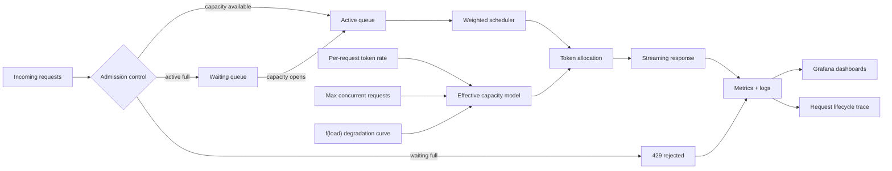

# **cLLM: A Controllable LLM Inference Control Plane for Scheduling and Scaling Experiments**

## 1. Abstract

Modern LLM serving systems are often evaluated through real GPU-backed deployments, which are expensive, non-deterministic, and difficult to experiment with safely. cLLM is a Kubernetes-native LLM inference control plane designed to model serving as a **token-throughput–constrained scheduling problem over shared GPU resources**.

The system provides an OpenAI-compatible API and supports both real backends (e.g., vLLM) and a synthetic execution mode that replays cached responses under a global tokens-per-second constraint. By decoupling system behavior from model execution, cLLM enables controlled, reproducible experiments on scheduling, routing, fairness, and backpressure—while still reproducing the system-level dynamics of real GPU inference.

---

## 2. Problem Statement

LLM serving systems exhibit complex behavior under load:

* Throughput saturates at GPU capacity
* Latency increases non-linearly beyond saturation
* Long requests can dominate compute
* Multi-tenant workloads introduce fairness challenges

Traditional approaches to evaluating these systems suffer from:

* **High cost** (GPU usage)
* **Low reproducibility** (hardware and runtime variability)
* **Limited control** over workload characteristics

The goal of cLLM is to provide a **deterministic, controllable environment** that reproduces the key dynamics of LLM serving systems, enabling safe and repeatable experimentation on control plane decisions.

---

## 3. System Goals

### Functional Goals

* OpenAI-compatible API for seamless integration
* Support both real inference backends and synthetic execution
* Model token-based throughput constraints

### Non-Functional Goals

* Deterministic, reproducible workloads
* Realistic latency and streaming behavior
* Fine-grained observability (per-request + system-level)
* Safe experimentation via live configuration

---

## 4. Architecture Overview

cLLM consists of three primary components:

### 4.1 Control Plane

* Request admission and scheduling
* Token-based throughput allocation
* Multi-tenant fairness enforcement

### 4.2 Execution Layer

* Real mode: routes to vLLM / OpenAI
* Synthetic mode: replays cached responses with controlled timing

### 4.3 Observability Layer

* Prometheus metrics (tokens/sec, TTFT, queue depth, latency)
* Grafana dashboards
* Structured logging with correlation IDs

The system is deployed alongside a real vLLM instance in Kubernetes, allowing **side-by-side comparison of simulated and real behavior on the same hardware**.

---

Here’s the updated Section 5 with the refined capacity model, the new interpretation section, and renumbered subsections.

---

## 5. Scheduling and Admission Control

### 5.1 Core Capacity Model

cLLM models inference capacity as a combination of parallelism and load-dependent degradation rather than a fixed global throughput limit.

The effective system capacity is defined as:

```text
Effective Capacity = (per-request token rate × max concurrent requests) × f(load)
```

Where:

* **per-request token rate** represents the ideal token generation rate for an isolated request
* **max concurrent requests** defines the level of parallelism the system can sustain efficiently
* **f(load)** is a configurable degradation function that reduces effective throughput as concurrency increases beyond optimal levels

This formulation captures two key properties of real GPU-backed inference systems:

1. **Parallel efficiency at low to moderate load**, where additional requests increase total throughput
2. **Gradual performance degradation under contention**, where increased concurrency reduces per-request throughput and increases latency

Unlike a fixed global tokens-per-second model, this approach produces **soft saturation behavior**, where throughput plateaus and latency increases non-linearly as the system becomes queue-bound.

---

### 5.2 Capacity Regimes and System Behavior

This model allows the system to simulate distinct operating regimes:

* **Throughput-bound regime**
  At low to moderate concurrency, total tokens/sec increases with additional requests as parallelism is utilized efficiently.

* **Contention regime**
  As concurrency approaches system limits, per-request throughput decreases due to shared resource pressure, while total throughput begins to plateau.

* **Queue-bound regime**
  Beyond saturation, additional requests primarily increase queueing delay (TTFT) rather than total throughput, resulting in non-linear latency growth.

These regimes mirror real inference systems, where GPU utilization, memory pressure, and scheduling overhead interact to produce complex, non-linear performance characteristics.



## Short verbal explanation

cLLM treats inference capacity as a function of **parallelism plus contention**, not as a fixed global tokens/sec limit. Incoming requests first go through admission control. If capacity is available, they enter the active queue; otherwise they wait, and if the waiting queue is full, they receive a 429.

The active requests are handled by a weighted scheduler that allocates token throughput based on the effective capacity model:

```text
Effective Capacity = per-request token rate × max concurrent requests × f(load)
```

As load increases, `f(load)` reduces effective throughput to simulate GPU contention. This creates realistic behavior: throughput rises at first, then plateaus, while TTFT and latency increase as the system becomes queue-bound.

---

### 5.3 Queue Structure and Admission Control

The scheduler maintains three request states:

* **Active queue**: requests currently consuming token capacity
* **Waiting queue**: buffered requests awaiting admission
* **Rejected requests**: requests exceeding system limits and returned as HTTP 429

Admission decisions are based on:

* effective token capacity
* maximum concurrency limits
* queue size thresholds

Backpressure is enforced via bounded queues and early rejection to prevent unbounded latency growth under overload.

---

### 5.4 Throughput Degradation

As concurrency increases beyond optimal levels:

```text
tokens/sec per request ↓
latency ↑
```

The degradation behavior is controlled by a configurable function `f(load)`, which allows the system to simulate:

* gradual contention
* soft saturation
* non-linear latency growth

This avoids unrealistic “hard cliff” capacity limits and better reflects real GPU scheduling dynamics.

---

### 5.5 Weighted Scheduling and Fairness

To support multi-tenant workloads and heterogeneous request sizes, cLLM implements weighted scheduling.

Weights are computed based on:

* **tenant priority** (e.g., interactive vs batch)
* **request size** (token length)
* **queue wait time** (aging to prevent starvation)

This approach:

* reduces head-of-line blocking
* improves tail latency for short or high-priority requests
* maintains overall system throughput

The result is a more realistic simulation of fairness and resource allocation in shared inference systems.

---

## 6. Realistic Generation and Execution Model

cLLM models inference as a two-phase process—**prefill** and **decode (streaming)**—with both phases driven by the same underlying capacity and load dynamics. Rather than treating latency as a fixed delay, the system applies **load-aware degradation and controlled variability** to reproduce the non-ideal behavior of real inference systems.

---

### 6.1 Prefill Latency

Prefill latency is modeled as a **load-dependent startup cost** proportional to prompt size:

```text
prefill_time ∝ prompt_tokens / effective_prefill_rate
```

Where:

* **effective_prefill_rate** is derived from the system’s capacity model and degrades as concurrency increases
* prefill latency increases under load, reflecting contention for CPU resources, memory bandwidth, and attention setup

To capture real-world variability, prefill includes:

* **Load-dependent degradation** — latency increases as system pressure rises
* **Jitter** — stochastic variation to simulate CPU scheduling, caching effects, and runtime overhead

Prefill is **coupled to the global capacity model**, ensuring that changes in throughput, concurrency limits, or degradation curves consistently affect both startup and generation behavior.

---

### 6.2 Decode and Streaming Behavior

After prefill, requests enter the decode phase, where tokens are emitted over time based on allocated throughput.

Token emission is governed by:

* **Allocated tokens/sec** from the scheduler
* **Weighted fairness**, based on tenant priority, request size, and queue age
* **System load**, via the degradation function

Streaming behavior includes:

* **Jitter and burstiness** — tokens are emitted in uneven intervals rather than a fixed cadence
* **Partial stalls** — probabilistic pauses that simulate:

  * attention bottlenecks
  * memory pressure
  * scheduling delays

These effects ensure that token generation reflects the variability of real GPU-backed inference rather than idealized constant-rate output.

---

### 6.3 Unified Load-Driven Behavior

Both prefill and decode phases are driven by the same underlying capacity model:

* At low load:

  * prefill is fast
  * tokens stream at near-ideal rates

* Under contention:

  * prefill latency increases
  * per-request throughput decreases
  * jitter and stalls become more pronounced

* Under saturation:

  * queueing dominates latency (TTFT)
  * streaming slows due to reduced token allocation

This unified model ensures that all phases of request execution respond consistently to system pressure, avoiding unrealistic scenarios where one phase degrades while others remain constant.

---

### 6.4 Latency Decomposition

Total request latency is decomposed into:

```text
Total Latency = TTFT + Streaming Duration
```

Where:

* **TTFT (Time To First Token)** includes:

  * queueing delay
  * scheduling delay
  * prefill latency

* **Streaming Duration** reflects:

  * token generation under throughput constraints
  * variability due to jitter and stalls

This decomposition allows precise attribution of latency to specific system behaviors, enabling targeted optimization of scheduling, admission control, and resource allocation.

---

## 7. Observability and Traceability

### 7.1 Request-Level Tracing

Each request is assigned a **correlation ID** and tracked through:

```text
admitted → queued → started → prefill → first_token → completed / rejected
```

This enables root-cause analysis of latency:

* queueing delay
* scheduling delay
* prefill cost
* streaming behavior
* stall events

---

### 7.2 System-Level Metrics

Key metrics include:

* tokens/sec (global + per request)
* TTFT (proxy for queueing delay)
* queue depth and wait time
* latency percentiles (P50/P95/P99)
* stall and prefill histograms

---

### 7.3 Latency Decomposition

```text
Total Latency = TTFT + Streaming Duration
```

Where:

* TTFT = queueing + scheduling + prefill
* Streaming duration = token throughput under contention

This decomposition enables precise reasoning about system bottlenecks.

---

## 8. Live Reconfiguration and Experimentation

The system exposes a `/config` API allowing runtime changes to:

* token capacity
* concurrency limits
* degradation curves
* scheduling weights
* realism parameters (prefill, jitter, stalls)

This enables:

* A/B testing of scheduling policies
* rapid iteration without restarts
* real-time observation of system behavior changes

---

## 9. Reproducible Workloads

cLLM treats cached prompts as **versioned workload artifacts**:

* prompt sets can be recorded and replayed
* token pacing derived from real BPE token counts
* identical workloads can be replayed across configurations

This ensures:

* deterministic benchmarking
* reproducible experiments

---

## 10. Validation Against Real Systems

cLLM is validated by running alongside vLLM in the same Kubernetes cluster:

* GPU telemetry via DCGM
* shared dashboards
* identical workloads

Observed alignment:

* throughput saturation behavior
* TTFT growth under load
* queue dynamics
* fairness effects

While hardware-level details are abstracted, the simulator accurately reproduces the **system-level behaviors that drive control plane decisions**.

---

## 11. Key Insights

1. **LLM serving is dominated by scheduling and queueing, not raw compute**
2. **Tokens are the correct unit of resource modeling**
3. **Latency is primarily driven by queueing under contention**
4. **Small scheduling changes can significantly impact fairness and tail latency**
5. **Deterministic simulation enables safer and faster iteration than GPU-only testing**

---

## 12. Future Work

* Multi-node routing across heterogeneous GPU clusters
* KV cache and memory pressure modeling
* adaptive scheduling based on real-time metrics
* failure injection (node degradation, network issues)

---

## 13. Conclusion

cLLM is not just a simulator—it is a **controllable, instrumented, and validated LLM inference system** that enables the design, testing, and validation of scheduling and scaling decisions before deploying to real GPU infrastructure.
